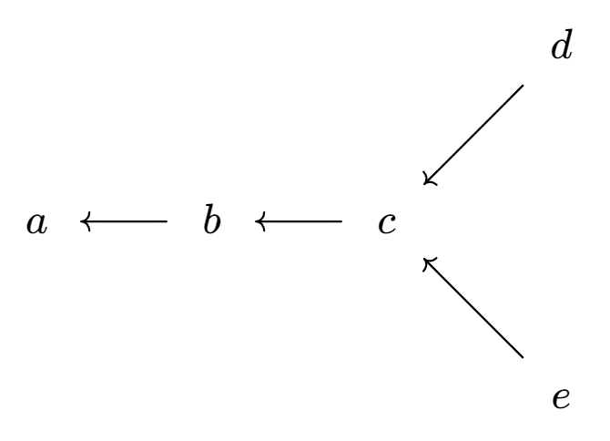

[TOC]

# 序言

由于集合论是宽泛的领域,在实分析中我们所运用到的不过是浅薄的实分析基础.$\xcancel{于是本章是提供给志在速成集合论以进行实分析内容方面研究的人所准备的,关于集合论方面的内容反而会比较少.}$

假定读者已经学过了傅里叶分析(数学分析),线性代数(高等代数).

忽然发现好像已经远远超出了实分析所需要的基础知识框架,旨在进行实分析学习的读者选择实分析中常见的一部分看即可

既然已经写了这么多,笔者打算将其写为一个在学完傅里叶分析与线性代数之后大部分课程的(主要是代数方面)一个基础知识.

# 公理体系

在介绍集合论的任何内容之前,按照惯例,我们都需要对其公理体系进行一个阐释,本文选取的是$\text{ZFC}(\text{Zermelo-Fraenkel-Choice})$公理体系并承认选择公理.

至于为何要定义这个公理体系?让我们把视角回到$\text{Cantor}$对于集合论下初始定义的时候,$\text{Cantor}$称集合($\text{Set}$)是一些确定的,不同的东西的总体($\text{Collection}$),这些东西人们能意识到,并且能判断一个给定的东西是否属于这个总体.但是这会造成一些矛盾(我们在类的部分会进行详细阐述)所以,为了安全地使用这个概念,集合论的公理体系便诞生了.

定义(集合) 集合($\text{Set}$)是一些确定的,不同的东西的总体($\text{Collection}$),这些东西人们能意识到,并且能判断一个给定的东西是否属于这个总体.

### 构筑

$\text{ZFC}$公理体系构筑于

* 一阶逻辑,其中具有常见的$\land$,$\lnot$,$\leftrightarrow$,$\forall$,$\exists$等逻辑连词与量词,括号$()$,变元$x,y,z,\cdots$和等号$=$(视为二元谓词)等;可以判定一个公式是否合乎语言的规则,比如括号的左右配对,合规者可以称为合式公式.这套语言是形式逻辑的标准基础
* 集合论所需的二元谓词$\in$和以下将列出的一套公理体系$\bold{A.0}-\bold{A.9}$.若$x\in  y$则称$x$为$y$中的元素.$\text{ZFC}$处理的所有对象$x,y$都应理解为集合;特别地,集合的元素本身也是一个集合,而集合$s$和仅含$s$的集合$\{s\}$是两回事

### 类

尽管$\text{ZFC}$公理体系并不承认类的概念,但是为了让读者更方便的理解集合论及其局限之处,我们还是介绍一下类的定义

定义(类) 令$\varphi(u)$为一个性质,则$\{u: \varphi(u)\}$不一定是一个集合(比如$\varphi(u):u$为集合),这样的一个对象称为类($\text{class}$),特别地,不是集合的类称为真类($\text{proper class}$)

显然的,每一个集合都是类,例如$\{x: x \neq x\}$.但是有些类不是集合,例如$R = \{X: X \notin X\}$就是一个真类,至于我们为什么要定义出类这个概念,还需要追溯回$\text{Bertrand Russell}$(也有人叫他罗素)在$1918$年把一个悖论通俗化,称为理发师悖论: 一个乡村理发师,自夸无人可与之相比,宣称他当然不给自己刮脸的人刮脸,但却给所有自己不刮脸的人刮脸.一天他产生了疑问:他是否应该给自己刮脸.假如他自己不刮脸的话,则按照他声言的前一半,他就不应该给自己刮脸;但是假如他自己不刮脸的话,按照他自夸的,他又必须给自己刮脸,这个理发师陷入了逻辑的窘境.

对于上述问题,我们把"理发师"改成"集合","给自己刮脸"改成"是一个集合",也就是说理发师悖论即一切集合所组成的集合到底是不是一个集合的问题.

看到上述问题,是不是感觉集合论的体系摇摇欲坠?但是路是死的人是活的,我们可以在一些不引起悖论的类之间进行讨论,也就是我们的集合论只考虑一些安全的类(后来的$\text{Grothendieck}$也提出$\text{Grothendieck}$宇宙的概念对于讨论的集合设立一个防火墙),这也就是$\text{Zermelo}$以及$\text{Fraenkel}$的工作.

$\text{Zermelo}$的计划是,只准许那些看来不大会产生矛盾的类进入集合论.例如空类(也就是我们先前所讨论过的空集),任何一个有限类,以及自然数的类,看来是安全地给定了一个安全地类,从它所形成的一些类,诸如任何一个子类,安全类的联合,以及一个安全类的所有子类所成的类,都应该是安全类.但是,他排除了求余,因为既是$x$是一个安全类,$x$的余类,即对象的某个大宇宙中所有的非$x$($\text{non-}x$)也未必是安全的.

$\text{Abraham A. Fraenkel}$改进了$\text{Zermelo}$所发展的集合论,$\text{von Neumann}$又对其加以改革(在此处不进行赘述).在$\text{Zermelo-Fraenkel}$系统中,避免悖论的希望寄托在将对于所容许的集合的类型加以限制,而同时又足够用来作为分析的基础.

### $\text{ZFC}$公理体系

$\bold{A.0}$ 存在公理($\text{Exi}$) 存在一个集合
$$
\exists x(x=x)
$$
这条逻辑公理提醒我们,我们所遵循的逻辑有一个本体上的承诺:我们所谈论的世界不能是虚无的,它至少存在着一个事物.

$\bold{A.1}$外延公理($\text{Ext}$) 两个有相同元素的集合相等
$$
\forall X\forall Y \forall u (u\in X \leftrightarrow u\in Y)\rightarrow X=Y
$$
由于$X= Y \rightarrow \forall u(u\in X \leftrightarrow u\in Y)$是基本的逻辑定理,于是我们有
$$
\forall u(u\in X \leftrightarrow u\in Y)\leftrightarrow X = Y
$$
这个公理表明集合是由其元素决定的.

$\bold{A.2}$配对公理($\text{Pai}$)对于任意$a$和$b$,存在一个集合只以$a,b$为元素,即
$$
\forall{a}\forall{b}\exists{c}\forall{x}(x\in c \leftrightarrow x = a \lor x=b)
$$
根据我们先前所描述的外延公理不难发现对于$c$有这样的集合$c$是唯一的(任何满足上述公理的集合$c$都相等),我们可以将其表示为$\{a,b\}$.

有序对$(x,y)$的概念也可以使用配对公理进行描述: 我们能定义$(x,y):= \{\{x\},\{x,y\}\}$由此可以定义积集$X \times Y:=\{(x,y):x\in X,y\in Y\}$;准此要领不难定义有限多个集合的积集$X \times Y \times \cdots$.集合间的映射$f:X \to Y$等同于它的图形$\Gamma_f \subset X \times Y$:对每个$x \in X$,交集$\Gamma_f \cap (\{x\}\times Y)$是一个独点集(不难发现这就意味着映射是良定义的),记作$\{f(x)\}$

$\bold{A.3}$分离公理模式($\text{Sep}$) 令$\varphi(u)$为公式. 对任意集合$X$,存在一个集合$Y = \{u \in X: \varphi(u)\}$:
$$
\forall X \exists Y \forall u (u\in Y \leftrightarrow u\in X \land \varphi (u))
$$
也可以写为
$$
Y = \{u \in X: \varphi(u)\}
$$
我们称其为分离公理模式,是因为其本质上可以代表无穷多条公理,试想,对于每一公式$\varphi$都存在一条相应的分离公理.由于$Y$实际上是$X$的一个子集,于是有时候也叫他子集公理.然而更多时候称其为分离公理.

至于分离公理为何基于一个集合$X$进行讨论呢?

我们先给出一个叫做"概括原则"($*$)的概念.给定一个性质$\psi(x)$,概括原则允许我们定义集合$Y = \{x: \psi(x)\}$但是这显然可以生成一些真类.于是分离公理需要一个已经存在的集合$X$,利用$\psi$将$Y$从$X$中分离出来.$\text{Zermelo}$指出:这条公理不同于概括原则之处就在于"它有以下限制.首要的是集合不能通过这条公理__独立地定义__,而是必须由已存在的集合中被__分离__出来"

有了分离公理模式,我们就可以进行如下操作

令$\varphi(u)$为一个性质:若存在集合$X$满足对于任意$u$,$\varphi(u)$蕴含着$u\in X$,则$\{u:\varphi(u)\} = \{u\in X:\varphi(u)\}$,根据分离公理可以得知这样的集合是存在的(任取一个集合$X$即可),并且这个集合并不依赖于$X$(根据外延公理可以得出),即如果有$X'$也满足$\varphi(u)$蕴含$u \in X'$则有$\{u\in X: \varphi(u)\} = \{u\in X': \varphi(u\}$这种情况下,考虑所有满足条件的集合$X$便可以得到$x \neq x \to x \in X$总是真的,于是根据$\bold{A.0}$可以得知至少存在一个集合.

即我们可以得到以下定义

定义(空集) $\{x:x \neq x\}$是一个集合,根据外延公理可知它是唯一的(考虑$A = \{u\in X: u\neq u\}$以及$B = \{u\in Y: u\neq u\}$可以得到$u\in A \leftrightarrow u\in B$)我们将其记为$\varnothing$也就是常说的空集.

由分离公理不难推导出集合的子集,真子集,交集$\cap$与差集$\setminus$具体的证明留给读者

$\bold{A.4}$并集公理($\text{Uni}$)对任意集合$X$,存在集合$Y$满足: $u\in Y$当且仅当存在$z \in X $使得$u \in Z$,即
$$
\forall X \exists Y \forall u (u\in Y \leftrightarrow \exists z(z\in X \land u\in z))
$$
这样的$Y$是唯一的,称为$X$的并,记为$\bigcup X$.特别地,我们定义$X \cup Y = \bigcup\{X,Y\}$

既然在$\bold{A.3}$中我们已然可以定义出集合的子集与真子集,接下来我们可以考虑一个集合所有子集构成的类,对于这个类,我们认为一个集合的所有子集组成一个新的集合.

$\bold{A.5}$幂集公理($\text{Pow}$) 对于任意集合$X$,存在集合$Y$满足$u\in Y$当且仅当$u \subset X$,即
$$
\forall X \exists Y \forall u (u\in Y \leftrightarrow u \subseteq X)
$$
由外延公理也可以得知这样的集合$Y$是唯一的,我们将其称为$X$的幂集($\text{Power Set}$),记为$\mathcal{P}(X)$有些文献中也直接记为$P(X)$或$2^X$(至于为什么是$2^X$则需要根据序数的定义进行说明,由于本章预计不会涉及到序数,于是在此进行介绍:考虑$X \to 2=\{0,1\}$,我们将所有对应到$1$的元素取出,利用分离公理模式可以得到其为集合$X$的一个子集,考虑所有这样的映射,构成一个集合,其即为集合$X$的幂集$\mathcal{P}(X)$,不难发现$|\mathcal{P}(X)| = 2^X$)

接下来我们可以定义集合的后继

定义:对于任意集合$x$,集合$x\cup \{x\}$称为$x$的后继,一般即为$S(x)$或者$x^+$

 $\bold{A.6}$($\text{Inf}$)存在集合$X$,$\varnothing \in X$,并且对任意$x\in X$,$x$的后继$S(x)$也属于$X$
$$
\exists X[\varnothing \in X \land \forall x(x\in X \to S(x) \in X)]
$$
不难看出,$\{0,1,2,3,\cdots\}\subseteq \omega$,所以无穷公理是一个集合.

这样的$X$称为归纳集,预设归纳集存在的用意在于萃取它的子集
$$
\{\varnothing,\{\varnothing\},\{\varnothing,\{\varnothing\}\},\{\varnothing,\{\varnothing\},\{\varnothing,\{\varnothing\}\}\},\cdots\}
$$
不难看出$\{0,1,2,3,\cdots\}\subseteq \omega$,所以无穷公理保证了它是一个集合.

> 番外
>
> 分析的严密化揭示人们有必要去了解实数集合的结构.为了处理这个问题,$\text{Cantor}$曾引进关于无穷点集的一些概念.$\text{Cantor}$认为无穷集合的研究是如此重要,以至于他就为此而承担起了无穷集合的研究.他期望这个研究能使他清楚地区分不同的不连续点的无穷集合.
>
> 集合论的中心难点是无穷集合这个概念本身.从希腊时代以来,这样的集合很自然地引起数学家门与哲学家们的注意,而这种集合本以及看来是矛盾的性质,使得对于这种集合的理解没有任何进展.$\text{Zeno}$的悖论(应该是那个著名的追乌龟问题)是难点中的第一个迹象,既不是直线的无穷可分性,也不是直线作为一个由离散的点构成的无穷集合,足以对运动作出合理的结论.
>
> $\text{Aristotle}$也讨论过无穷集合,例如整数集合,但是他并不承认一个无穷的集合可以作为固定的整体而存在,对于他来说,集合只能是潜在无穷的($\text{potentially infinite}$).
>
> 但是$\text{Proclus}$($\text{Euclid}$的注释者)注意到圆的一根直径分圆成为两半,由于直径有无穷多个.但他使用这样的说法来解决这个矛盾,他说:任何人只能说很大很大的数目的直径或半圆,不能说一个实实在在无穷多的直径或半圆.换句话说,$\text{Proclus}$接受$\text{Aristotle}$的潜在无穷概念而不接受实无穷($\text{actual infinity}$)这样就回避了两个无穷大等于一个无穷大的问题.
>
> 哪怕是$\text{Gauss}$也反对把一个无穷量当作实体,"这在数学中是从来不允许的.无穷只是一种说话方式,当人们确切地说到极限时,是指某些比值可以任意近地趋近它,而另一些则允许没有界限的增加"$\text{Cauchy}$也不承认无穷集合的存在,因为部分能同整体构成一一对应这件事在他看来是荒谬的.
>
> 但是总有人认为无穷集合必须存在,第一个作出这个尝试的人是$\text{Bolzano}$,在他的《无穷悖论》一书(在他死后三年才出版)中他维护了实在无穷集合的存在,并且强调了两个集合等价的概念,这就是后来叫做两个集合的元素之间的一一对应关系,这个等价概念,适用于有限集合,同样也适用于无穷集合.他注意到在无穷集合的情形,一个部分或子集可以等价于整体;他并且坚持这个事实必须接受.例如$0$到$5$之间的实数通过公式$y = 12x/5$可以与$0$到$12$之间的实数构成一一对应,虽然这第二个数集包含了第一个数集.对于无穷集合,同样可以指定一种数叫超限数,使得不同的无穷集合有不同的超限数,虽然$\text{Bolzano}$关于超限数的指定根据$\text{Cantor}$的理论来看是不正确的.
>
> $\text{Bolzano}$关于无穷的研究,其哲学意义比数学意义来得多,并且没有充分弄清楚后来称之为集合的势或说集合的基数的概念.他同样遇到一些性质在他看来属于悖论.他认为,对于超限数无需建立运算(但是$\text{Cantor}$在他的序数理论里确确实实把$\aleph$数构造了出来),所以不需要深入研究.
>
> 接下来,有请集合论的创建者$\text{Georg Cantor}$登场,关于他的背景介绍在此略过.我们直接讨论他关于集合论的观点.
>
> 他认为,那些认为只有潜在实无穷集合的人是错误的.
>
> 对于$\text{Cantor}$来说,如果一个集合能够和它的一部分构成一一对应,它就是无穷的.他的一些集合论的概念,如集合的极限点、导集、第一型集等,是在一篇关于三角级数的文章中定义而且使用了的.一个集合称为是闭的,假如它包含了它的全部极限点(后面的正文会进行介绍);是开的,假如它的每一个点都是内点,即每一个点可以包含在一个区间内,这区间的点都属于这个集合.一个集合称为完全的,假如它是闭的并且它的每一个点都是它的极限点.
>
> $\text{Cantor}$寻求像"大小($\text{size}$)"这样的概念来区分无穷集合.他和$\text{Bolzano}$一样,认为一一对应关系是基本原则.两个能够一一对应的集合称为是等价的或具有相同的势(后来"势($\text{Power}$)"这个名词改成了"基数($\text{cardinal number}$)").两个集合可以具有不同的势.如果在$M$与$N$两个集合中,$N$能与$M$的某个子集构成一个一一对应,而$M$不可能与$N$的任何子集构成一一对应,就说$M$的势大于$N$的势.
>
> 数集自然是最重要的,所以$\text{Cantor}$用数集来阐述他关于等价或势的概念.$\text{Cantor}$引入了"可列"的概念,凡是能和正整数构成一一对应的任何一个集合就可以称为可列集合.这是最小的无穷集合.
>
> 在他论证了相同的势和不同的势的集合都存在之后,它继续研究集合的势这个概念并且引进了基数和序数的理论,其中超限基数($\text{transfinite cardinal number}$)和超限序数($\text{transfinite ordinal number}$)是惊人的创造(确实)
>
> 他认为,他的关于无穷数或超限数的理论,不同于普通所说的一个变量变得无穷小或无穷大的那个无穷概念.两个一一对应的集合具有相同的势或基数.对于有限集合来说,基数就是这个集合中元素的个数.对于无穷集合来说,要引进新的技术.自然数集合的基数就用$\aleph_0$来表示.由于实数不能和自然数构成一一对应(正文连续统假设部分有证明),实数必然有另一个基数.
>
> 接下来$\text{Cantor}$定义了集合基数的乘法与加法,在此不进行赘述
>
> 下一个概念便是序数的概念.它在引进一个已知集合的逐次导集的时候,造就发觉到序数概念的重要.他现在抽象地来引进这个概念,一个集合叫全序的($\text{simply ordered}$),假如它的任何两个元素之间有一个确定的顺序(以后或许会详细的讲一下序关系的概念,全序也称为线序或链,因为其上任意两个元素均可比,就像排在一条链上一样).即若给定$m_1$和$m_2$,要么有$m_1$先于$m_2$,要么有$m_2$先于$m_1$即$m_1< m_2$或$m_2 < m_1$必有一个成立.不难验证其满足传递性.
>
> 两个全序集被称作是相似的,若它们是一一对应且保留顺序(也称为保序双射,即同构),即若$m_1$对应于$n_1$,$m_2$对应于$n_2$,而$m_1<m_2$则必然有$n_1<n_2$.两个相似的集合具有相同的序型或序数,序数即为一个全序集$M$的集合顺序的序型.
>
> $\text{Cantor}$考虑了正整数集合,根据它们的自然顺序,其序数用$\omega$表示,另一方面,按照递减顺序的正整数集合$\cdots,4,3,2,1$,其序数用$^*\omega$表示正、负整数或者零所成的集合按通常的排序的顺序,其序数为$^*\omega +\omega$.
>
> 接着$\text{Cantor}$定义了序数的加法与乘法,两个序数的和是第一个全序集的序数加上第二个全序集的序数,顺序即按其特殊规定.例如按自然数的顺序的正整数集合之后随着五个最初的正整数所构成的集合,即
> $$
> 1,2,3,\cdots,1,2,3,4,5
> $$
> 其序数为$\omega+5$.序数的相等与不等也可以显然的给的给出定义,
>
> 现在,他引进超限序数的整个集合,这在一方面时基于它本身的价值,另一方面是为了确切地定义较大的超限基数.为了引进这些新的序数,他把全序集限制在良序集($\text{well - order}$)的范围之内.若一个全序集有最小的元素,且它的每一个自己都有最小的元素,那么这个全序集就叫良序集.
>
> 序数和基数都存在着级别.第一级是所有有限的序数
> $$
> 1,2,3,\cdots
> $$
> 我们用$\Z_1$表示上述的第一级序数.在第二级的序数是
> $$
> \omega ,\omega+1,\omega+2 ,\cdots,2\omega,2\omega+1,\cdots,\\
> 3\omega,3\omega+1,\cdots,\omega^2,\cdots,\omega^3,\cdots,\omega^\omega
> $$
> 我们用$Z_2$表示,其中每一个都是基数为$\aleph_0$的集合的序数.
>
> $\Z_2$作为上述序数构成的集合,应该也有一个基数.这个集合是不可列的,从而$\text{Cantor}$引入了一个新的基数$\aleph_1$作为集合$\Z_2$的基数,并且证明了$\aleph_1$是$\aleph_0$的后继基数.
>
> 第三级基数的序数用$\Z_3$表示,它们是
> $$
> \Omega,\Omega+1,\cdots,\Omega+\Omega,\cdots
> $$
> 这些是良序集中基数为$\aleph_1$的集合的序数.而$\Z_3$这个序数的集合的基数大于$\aleph_1$,$\text{Cantor}$用$\aleph_2$来表示它的基数.这个序数与基数的级别可以无穷无尽地这样继续下去.

$\bold{A.7}$替换公理模式($\text{Rep}$)给定公式$\psi(x,y)$,并且对任意$x$有唯一的$y$使得$\psi(x,y)$成立.则对任意集合$A$,以下集合存在
$$
B = \{y: \exists x (x\in A \land \psi(x,y))\}
$$
用公式表示就是
$$
\forall A \forall x \in A \exists! y\psi(x,y) \rightarrow \exists B \forall x \in A\exists y \in B\psi(x,y)
$$
首先注意到对每一公式$\psi$,都有一个相应的替换公理,因此与分离公理模式一样,替换公理模式代表了无穷多条公理.其次,公式$\forall x\in A \exists!y \psi(x,y)$实际上是说$\psi$表示的性质是一个函数,于是替换公理模式是说,任何集合在一个函数下的像仍然是一个集合.因为这个像的元素个数不会比原像个数多.所以它不会是一个更大的集合,一般来说引起麻烦的集合都是"大"的集合,于是替换公理模式是安全的.

$\bold{A.8}$正则公理($\text{Fnd}$)对任意集合$x \neq \varnothing$,存在$y \in x$使得$y \cap x = \varnothing$
$$
\forall x(x \neq \varnothing \to \exists y(y \in x \land x \cap y = \varnothing))
$$
正则公理,它实际上断定的是: 对任意非空集合$x$,$x$中总有一个元素$y$是关系$\in$限制在$x$上的"最小元".也就是说,$x$中再也没有元素属于$y$了.

可以得到一个直接的推论

我们假设$x \in x$,令$\mathcal{I} = \{x\}$,则对$\mathcal{I}$的任意元素,事实上$\mathcal{I}$只有一个元素,$x$,都有$x \cap I = x \neq \varnothing$于是可以得知任意集合$x$都不属于自身.

于是不会存在无穷的从属链$x\ni x_1 \ni x_2 \ni \cdots$.

可以根据正则公理建立集合的层垒谱系(过于复杂,本章不讲)

$\bold{A.9}$选择公理($\text{AC}$)设集合$X$的每个元素皆非空,则存在函数$g : X \to \bigcup{X}$使得$\forall x \in X ,g(x)\in x$(称为选择函数)

选择公理中的$X$应该设想为一族非空集,选择函数$g(x)\in x$意味着从每个集合$x\in X$中挑出一个元素.

## 总结

公理集合论是当代数学的正统基础,它的表述范围之广,形式化程度之高,以至于数学本身也堪称为研究对象,诸如何谓证明,一个命题能否被证明,公理系统的一致性(无矛盾)等等都能被赋予明晰的数学内容,这类研究称为__元数学__.数学实践中平素基于自然语言的定义和论证等等,在原则上都能够改写为$\text{ZFC}$公理体系或其他公理体系集合论里的形式化语言,从而为其陈述和验证赋予一套坚实的基础.

# 集合的运算

## 集合的运算

#### 基本运算

交：$A\cap B : = \{x: x\in A \land x\in B \}$($\land$代表与条件)

并：$A\cup B := \{x:x\in A \lor x\in B \}$

差：$A\setminus B := \{x:x\in A \land x\notin B\}$

对称差：$A \Delta B = (A\cup B)\setminus (A\cap B)$

并和交可以推广到一般的情形
$$
\bigcup_{a\in I}A_{\alpha} &=& \{x : \text{有} \alpha \in I ,\text{使}x \in A_{\alpha}\}\\
\bigcap_{a\in I}A_{\alpha} &=& \{x : \text{对一切}\alpha \in I , \text{有}x\in A_{\alpha}\}
$$
其中$\alpha$是集合的指标,它在某个固定的指标集$I$中变化.

若$S \supset B$,则称差$S \setminus B$为$B$关于$S$的余集.若包含集$S$已经清楚地指明或由上下文可以理解时,就简称$S\setminus B$为$B$的余集,记作$B^c$.

#### 积集

在实分析中积集并不需要像代数一样的严格定义

代数对于笛卡尔积的定义:

定义($\text{Cartesian}$积)令$\{A_i:i\in I\}$是一族以$I$为指标集的(非空)集合.$A_i$的笛卡尔积是一个由所有的$i\in I$满足$f(i)\in A_i$的$f : I \to \bigcup_{i\in I}A_i$构成的集合.将其记作$\prod_{i\in I}A_i$

实分析中则不需要这么严谨的定义积集,一般直接将一切有序偶$(a,b)$(其中$a \in A,b \in B$)所成的集合称为$A$与$B$的直积或者$\text{Cartesian}$积,记为$A\times B$.类似两个集的直积,可以定义多个集的直积.

# 映射

## 二元关系与多元关系

关系($\text{Relation}$)是指两个或两个以上的事物(事物可以是自己)之间的联系.在集合论中,最简单的关系是两个集合$A,B$之间的关系,我们将其称为二元关系,它可以看作一种对应($\text{correspondence}$).可以将其视为一个有序偶$(a,b)$其中$a\in A,b \in B$(从前文的积集可以得到严格定义,在配对公理$\bold{A.2}$中对其存在性进行了探讨),即当出现第一个元素$a$时,我们根据有序偶得到第二个元素$b$.于是,关系的核心在于有序偶,关系其实就是有序偶所构成的一个集合.

根据我们上文的介绍,可以得到关系的严格定义如下

定义(二元关系):一个集合$R$称为二元关系,如果存在集合$X,Y$,$R \subset X\times Y$.这样,二元关系$R$中的所有元素都是有序对,即,对任意$z \in R$存在$x\in X$和$y\in Y$满足$z = (x,y)$.

一般地,用$R(x,y)$来表示$(x,y) \in R$,称$x$和$y$有关系$R$.有时习惯的写作$xRy$.

接下来由于$R$依赖于$X$和$Y$,于是可以根据它们之间互相的依赖关系定义$R$在$X$上所占用的元素(是$X$的一个子集)与$Y$上所占用的元素(是$Y$的一个子集).

令$R$为二元关系

1. $R$的定义域定义为$\text{Dom}(R) = \{x: \exists y R(x,y)\}$
2. $R$的值域定义为$\text{R}(R) = \{y| \exists xR(x,y)\}$
3. 如果$R \subset X\times X$,则称$R$是$X$上的二元关系.

接下来给出一些常见的定义

1. 集合$X$在关系$R$下的像为
   $$
   R(X)=\text{Im}(X) = \{y \in \text{R}(R) : \exists x\in X(R(x,y))\}
   $$
   
2. 集合$Y$在关系$R$下的逆像定义为
   $$
   R^{-1}(Y) = \{x\in \text{Dom}(R) : \exists y \in Y(R(x,y))\}
   $$
   
3. 二元关系$R$的逆定义为
   $$
   R^{-1} = \{(x,y): (y,x) \in R\}
   $$
   
4. 二元关系$R$和$S$的复合定义为
   $$
   S \circ R = \{(x,z): \exists y((x,y)\in R \land(y,z)\in S)\}
   $$
   

不难发现二元关系对应的是二元$\text{Cartesian}$积,若我们将其推广到多元自然也可以得到多元关系,这部分请读者自行推导.

### 等价关系

接下来我们揭示一种在二元关系上的特殊关系,这是参考$=$号而推广出来的概念.

首先,我们需要研究一下等号所具备的性质(其不同于其他表示大小的符号的地方).

1. (自反性)$a = a$,这对于大小于号不成立
2. (对称性)$a = b \Rightarrow b = a$
3. (传递性)$a = b, b = c \Rightarrow a= c$(这对于偏序集中部分(序)情况不成立,在后文会讲)

而等号显然是一种关系(可以选取所有满足等号的有序偶构成一个集合)

于是我们便可以从中抽象出等价关系这一概念.

对于关系$\sim$,若其为等价关系,其满足

1. (自反性)$a \sim a$,
2. (对称性)$a \sim b \Rightarrow b \sim a$
3. (传递性)$a \sim b, b \sim c \Rightarrow a\sim c$

由于其满足自反性,于是集合$A$中任意一个元素$a$都可以对于自身满足$\sim$关系.

于是对于整个集合$A$,我们可以对于每个元素$a$所满足的$a \sim b$使用分离公理模式$\bold{A.2}$构建一个子集$\{b\in A: a\sim b\}$.由于传递性的存在,这个子集中两两元素之间是相互等价的.于是这个子集中任意一个元素都可以对于这个集合进行代表,我们称这个集合为$A$中的一个等价类.记为$[a]$

不难发现$A = \bigcup_{a\in A}[a]$并且若无$a \sim b$,则有$[a] \cap [b] = \varnothing$(读者自证,使用反证法).

于是我们可以将所有的不相交的$[a]$中的$a$提出并做成一个集合$I = \{a: \text{每个}[a]\text{中只有一个元素}a\text{被选出}\}$.

可以得到
$$
A = \bigsqcup_{a\in I}[a]
$$
其中$\sqcup$表示无交并.上式请读者自行验证.

我们称$A/\sim = \{[a]:a\in I\}$为$A$的商集.

## 基本的映射

设$X$与$Y$都是非空集.若按照一定法则$f$,对于$X$中每个元$x$,都存在$Y$中一个确定的元$y$与$x$相对应,则称$f$为定义在$A$上取值于$B$中的一个函数或映射,记作$y = f(x)$.

即
$$
f:X \to Y , x \mapsto y
$$
$y$称为$x$在映射$f$之下的像,对于固定的$y$,$X$中满足$y = f(x)$的所有$x$全体称为$y$的原像(使用分离公理模式可以保证成立).集$X$称为$f$的定义域,记作$\text{Dom}(f)$(domain),集$Y$称为$f$的值域(range),记作$\text{R}(f)$(在映射中也经常记为$\Im(f)$).若$X$是空集$\varnothing$,我们就规定$f(X) = \varnothing$.

若$A\subset X,B\subset Y$则$f(A) = \{f(x):x\in A\}$称为$A$在$f$下的像集,$f^{-1}(B) = \{x\in X : f(x)\in B\}$称为$B$在$f$下的原像集.

也可以利用配对公理构建映射:

集合间的映射$f:X \to Y$等同于它的图形$\Gamma_f \subset X \times Y$:对每个$x \in X$,交集$\Gamma_f \cap (\{x\}\times Y)$是一个独点集(不难发现这就意味着映射是良定义的),记作$\{f(x)\}$

### 映射的性质

设有映射$f : A \to B$.若$f(A) =B$,即对于$B$中的每个元$y$,都存在$A$中的元$x$使得$f(x) = y$则称$f$是一个满射.

若$f(A)$中每个元$y$都存在一个唯一的元$x$使得$f(x) = y$,或者等价地对于$A$中任意两个不同的元$x_1$和$x_2$都有$f(x_1)\neq f(x_2)$,则称$f$是一个内射(单射)或者一一映射(不是一一对应);若$f$既是一个满射又是一个内射,也就是说对于$B$中的每一个元$y$,$A$中均存在一个唯一的元$x$使得$f(x) = y$,则称$f$是一个双射.

设映射$f : A \to B$是一一的,则对于$f(A)$中的每个元$y$都存在$A$中的唯一的元$x$与之对应,这样我们就得到一个$f(A)$上取值于$A$中的映射,称它是$f$的逆映射,记作$f^{-1}:f(A)\to A$.

定理:

1. $f^{-1}f(A)\supset A$,当且仅当$f$为单射时$f^{-1}f(A) = A$

   对于$x\in A$有$f(x)\in f(A)$于是得到$x\in f^{-1}f(A)$即$A\subset f^{-1}f(A)$

   若$f^{-1}f(A) = A$则对于任意的$x \in f^{-1}f(A)$有$x \in A$,于是$\{x\in X: f(x)\in f(A)\} = A$若$f$不为单射,则对于$x_1 \in A$,存在$x_2 \in X$(不妨设$x_2 \notin A$)使得$f(x_1) = f(x_2)\in f(A)$此时$f^{-1}f(A)\neq A$.

   而$f$为单射时,不存在这样的$x_2$于是得到此时$f^{-1}f(A)=A$

2. $ff^{-1}(B)=f(X)\cap B \subset B$当且仅当$f$为单射时$ff^{-1}(B) = B$

   即证$ff^{-1}(B) = f(X)\cap B$即$\{f(b): b \in f^{-1}(B)\} = f(X)\cap B$不难发现若$x \in \{f(b): b \in f^{-1}(B)\}$则有$x\in f(X)$($B \subset X$)且$x\in B$($x\in f^{-1}(B)$)于是得到$x\in f(X)\cap B$.同理,若$x\in f(X)\cap B$则有$x\in f(X)$且$x\in B$于是得到$f^{-1}(x)\subset X$且$f^{-1}(x) \subset f^{-1}(B)$于是得到$f^{-1}(x)\subset X\cap f^{-1}(B)$即$b \in f^{-1}(x)$有$b \in X \cap   f^{-1}(B)$即$b \in f^{-1}(B)$于是有$x \in \{f(b) : b \in f^{-1}(B)\}$

   任意$ff^{-1}(B) = B$则$\{f(x):x\in f^{-1}(B)\} = B$若$f$不为满射,即$\exists y \in Y,\forall x \in X, f(x)\neq y$于是得到$f(X)\neq Y$即不一定有$f(X)\cap B = B$.

   若$f$为满射则有$f(X) = Y$即$f(X)\cap B = B$

3. $$
   \begin{eqnarray*}
   A_1 \subset A_2 \subset X &\Rightarrow& f(A_1)\subset f(A_2)\\
   B_1 \subset B_2 \subset Y &\Rightarrow& f^{-1}(B_1)\subset f^{-1}(B_2)
   \end{eqnarray*}
   $$

   由于$A_1 \subset A_2$于是有$x \in A_1 \Rightarrow x\in A_2$于是得到$x \in f(A_1)\Rightarrow x\in f(A_2)$于是得到$f(A_1)\subset f(A_2)$

   同理得到下式

4. $f(A)\subset B \Leftrightarrow A\subset f^{-1}(B)$当且仅当$f$为满单射时,$f(A) = B \Rightarrow A =f^{-1}(B)$

   根据前几条性质直接得证

接下来引入集合的交并差运算观察映射是否能够保持这些性质

1. 集合$A$,$B$与映射$f$使得$f(A \cap B) \neq f(A)\cap f(B)$

   不妨考虑集合$X = \{a,b\}$,令$A = \{a\},B= \{b\}$且
   $$
   f : X &\to& Y\\
   a &\mapsto& c\\b &\mapsto& c
   $$
   其中$c\in Y$,不难得到$f|A$($f$在集合$A$上的限制)和$f|B$,有$f(A)\cap f(B) = \{c\}$且$f(A\cap B) = f(\varnothing) = \varnothing$,证毕$\Box$

   注: 但是我们不难证明$f(A\cap B)\subset f(A)\cap f(B)$

   于是可以得到
   $$
   f(\bigcap_{a \in I}A_a)\subset \bigcap_{a \in I}f(A_a)
   $$
   
   
   
2. 集合$A,B$与映射$f$使得$B\subset A$而$f(A\setminus B) \neq f(A)\setminus f(B)$

   设$A$和$B$是集合$X$的子集,且有$B \subset A$且$B \neq A$,$f$是把$X$中的每个元映射成$Y$中元$a$的一个映射,于是有
   $$
   f(A\setminus B) = \{a\},f(A)\setminus f(B) = \varnothing
   $$
   因此$f(A\setminus B) \neq f(A)\setminus f(B)$

   注: 不难发现$f(A)\setminus f(B) \subset f(A \setminus B)$.

3. $f(A)\subset f(B)$不蕴含$A \subset B$的映射$f$.

   设$A,B$是$X$的非空子集,使$A$不含在$B$中,$f$是把$X$中的元映射成$Y$中某个固定元$a$的映射,则
   $$
   f(A) = f(B) = \{a\}
   $$
   但是并没有$A \subset B$.
   
4. $f(A_1 \cup A_2) = f(A_1)\cup f(A_2)$

   对于任意的$x \in A_1 \cup A_2$有$f(x) \in f(A_1 \cup A_2)$但是由于$x \in A_1 \cup A_2 \Leftrightarrow (x\in A_1)\lor (x\in A_2)$于是可以得到$(f(x) \in f(A_1)) \lor(f(x) \in f(A_2))$

   于是可以得知$f(A_1\cup A_2) = f(A_1)\cup f(A_2)$

   于是可以推广得到
   $$
   f(\bigcup_{a \in I}A_a) = \bigcup_{a\in I}f(A_a)
   $$

不难验证映射关于原像还有如下性质,请读者自行解决

1. $f^{-1}(\bigcup_{a \in I}B_a) = \bigcup_{a \in I}f^{-1}(B_a)$
2. $f^{-1}(\bigcap_{a \in I}B_a) = \bigcap_{a \in I}f^{-1}(B_a)$
3. $f^{-1}(B_2 \setminus B_1) = f^{-1}(B_2)\setminus f^{-1}(B_1)$

## 复合映射(映射的合成)与恒等映射

### 复合映射

设$f : X \to Y$,$g:Y \to Z$是两个映射,若对$\forall x\in X$,存在$z = g(f(x))$与之对应,于是得到一个映射$h : X \to Z$,称为由$f$与$g$复合而成的映射,记作$g \circ f$,即
$$
h = g \circ f:X \to Z, x \mapsto g(f(x)) = h(x)
$$
接下来讨论复合映射的原像集,$\forall E \subset Z$,取$\forall x \in h^{-1}(E) \Leftrightarrow h(x) = g(f(x))\in E\Leftrightarrow f(x)\in g^{-1}(E) \Leftrightarrow x \in f^{-1}\circ g^{-1}(E)$

于是得到$h^{-1}(E) = f^{-1}\circ g^{-1}(E)$

有了映射的合成我们才方便研究映射的逆,即是否存在一个映射将原映射的元素映射回其原来位置.

### 恒等映射

对于任意的集合$X$,不难发现存在一个映射$f$满足$f:X \to X ,x \mapsto x$.即$f(x) = x$,我们称这样的映射为$X$的恒等映射,记为$\text{id}_X$(或$I_X$)

不难发现映射$f : X \to Y$是一个由$X$集合射向$Y$集合的过程,那么是否存在一个映射$g : Y \to X$将$f$像$f(x)$变回其原像$x$,这时$f$又应该满足什么性质呢?

上述问题即是否存在$g : Y \to X$使
$$
g \circ f = \text{id}_X
$$
那么此时对于任意的$x \in X$都有$g \circ f(x) = x$.若$f$不为单射,则存在$x_1,x_2$使得$f(x_1) = f(x_2)$那么此时$x_1 = g(f(x_1)) = g(f(x_2)) = x_2$由于$x_1 \neq x_2$,导出矛盾.于是得到当且仅当$f$为单射时存在$g : Y \to X$使得$g \circ f = \text{id}_X$

那么$g$又应当满足什么性质呢?

由于对于任意的$x \in X$都有$g \circ f(x) = x$于是不难发现$g$的像集覆盖整个$X$,即$g$为一个满射.

此时的$g$将$f(x)$映射回$x$即为$f$的一个逆,由于其通过左合成将$f(x)$映射回$x$于是称其为$f(x)$的一个左逆记作$f_l^{-1}$.

接着调换$g,f$的角色得到
$$
f \circ g = \text{id}_Y
$$
有$f$为满射.不难得到此时$g$为单射,同理,此时$f$是$g$的一个左逆,也可以说$g$是$f$的右逆,将$g$记作$f_r^{-1}$

不难发现若$f$的左逆和右逆均存在时,左逆即为右逆$f_l^{-1} = f_l^{-1} \text{id}_Y = f_l^{-1}(f\circ f_r^{-1}) = \text{id}_X \circ f_r^{-1} = f_r^{-1}$.

根据上文的讨论,不难得出,若$f: X \to Y$,$g: Y \to X$是两个映射且满足
$$
f \circ g = \text{id}_Y , g \circ f = \text{id}_X
$$
则$f,g$均为双射,且$g =  f^{-1}$

# 序关系与序数

虽然个人认为实分析并不需要序关系和序数的概念,但是由于基数和序数以及序关系存在着密不可分的联系,故此引入序关系.(本节可略过)

依照$\text{Bourbaki}$的观点,序结构连同拓扑和代数结构一道组成了数学结构的三大母体.

## 序关系与偏序集

定义(偏序集) __偏序集__ 意指资料$(P, \leq)$,其中$P$是集合而$\leq$是$P$上的二元关系(称其为偏序),满足于

* 反身性 $\forall x \in P,x \leq x$
* 传递性 $(x\leq y)\land(y \leq z) \Rightarrow x \leq z$
* 反称性 $(x \leq y)\land (y \leq x)\Rightarrow x= y$

仅仅满足反身性以及传递性的结构称为预序集.预序集间满足$x \leq y \Rightarrow f(x)\leq f(y)$的映射称为保序映射.

> 一般使用$x < y$表示$x\leq y$且$x \neq y$.符号$\geq$和$>$的意思是自明的.今后谈及偏序时经常省略其中的关系$\leq$

 设$P,Q$为偏序集,若映射$\phi : P \to Q$满足$(x <x') \Rightarrow(\phi(x)<\phi(x'))$则称$\phi$是严格增的.若$\phi: P \to Q$是双射并且$\phi$和$\phi^{-1}$均为保序映射,则称$\phi$为$P,Q$之间的同构.偏序集的__同构类__称为序型.偏序集的子集集成了自然的偏序结构.

既然偏序集中有大小的概念,自然就存在着一条链上极大元和极小元的概念,对于一个偏序集的子集存在上界与下界的概念

我们依照如下方式定义它们.

定义: 设$P' \subset P$,而$P$是预序集.

* 称$x \in P$是$P$的极大元,如果不存在满足$x <y$的元素$y \in P$
* 称$x \in P$是$P'$的上界(注意,此处是$P'$)如果对于每个$x' \in P'$都有$x' \leq x$
* 称$x \in P$是$P'$的上确界,如果$x$是其上界,而且对每个上界$x' \in P'$满足$x' \leq x$

同理,不难定义出极小元,下界和下确界,仅仅需要把上面的$\leq$换成$\geq$.对于偏序集$P$,根据反称性,其子集$P'$的上确界或下确界若存在则是唯一的,分别即为$\sup P'$和$\inf P'$

若偏序集$P$是非空的,并且对任何的$x,y\in P$子集$\{x,y\}$都有上界,则称$P$是__滤过序集__.

## 全序

不难发现序关系其实可以表现为一张有向图,比如

上图就是一种序关系,其中$\to$可以视为$\leq$,于是不难发现,在这种关系下,我们无法确定$d$和$e$之间的大小关系,那么能够确定两两元素之间的大小关系的偏序集也就具有了一定的特殊性,不难发现其构造应当像一条链子或者线一样.

定义(全序集) 若偏序集$P$中的任一对元素$x,y$皆可以比大小(即:要么有$x \leq y$要么有$y \leq x$)则称$P$是__全序集__.全序集又称作线序集或者链.

显然有全序集是滤过的.

## 良序

接下来考虑全序集$\Z_{\geq0}$与$\Z$,不难发现它们仍有区别,取$\Z_{\geq0}$的任意子集$\Z_n$都存在一个最小元$a\geq0$,但是对于$\Z$,取其子集$\{x\in \Z,x< 0\}$可以得知该子集是没有最小元的,于是对于全序集仍然可以作一个划分.

定义(良序集,$\text{Cantor}$)全序集$P$满足下述性质便可以称为良序集:每个$P$的非空子集都有极小元.

接下来研究良序集的性质:

设$P$为良序集,映射$\phi : P \to P$严格增,则对每个$x\in P$都有$\phi(x)\geq x$(由严格增的定义可以推导出,其证明方式为$\phi(\phi(z))<\phi(z)<z$,取$z$为极小元便可以得到$\phi(z)<z$,但是由于$z$为极小元,于是有$\phi(z) =z$),特别地,

1. 可以得到$P$没有非平凡的自同构(由于$P$的每个子集均有极小元,若$P$不为良序集可以通过将$P$中的元素前移一位实现)
2. 对于任意的$x\in P$,不存在从$P$到$P _{<x}:= \{y\in P: y<x\}$的同构(若存在则存在$\phi : P \to P_{<x}$,其必然为$P$到自身的严格增映射并且满足$\phi(x)<x$,但是由于$P$没有非平凡的自同构,于是不成立)

形如$P_{<x}$的子集继承了$P$的良序,称作$P$的一个前段,记作$P[x]$.

既然得到了前段的定义,我们也就可以考虑两个良序集$(W_1,<_1)$,$(W_2,<_2)$之间的同构了

引理: 若$(W_1,<_1)$和$(W_2,<_2)$同构,则它们之间的同构是唯一的.

[证明]

设$W_1$和$W_2$之间存在两个同构$f,g$接下来令$h = g^{-1}\circ f: W_1 \to W_1$不难发现$h$也是同构并且有$h = \text{id}_{W_1}$即$h$为恒等映射,于是自然有$g = f$

定理(良序集基本定理) 如果$(W_1,<_1)$和$(W_2,<_2)$为良序集,则以下的条件恰有一个成立(在不构成混淆的时候$<_1$和$<_2$均使用$<$代替

1. $W_1$和$W_2$同构
2. $W_1$与$W_2$的前段同构
3. $W_2$与$W_1$的前段同构

[证明]

定义$f \subset W_1 \times W_2$
$$
f=\{(x,y) \in W_1 \times W_2:W_{1}[x] \text{同构于} W_{2}[y]\}
$$
不难发现若存在$W_{1}[x_1]$与$W_{1}[x_2]$与$W_{2}[y]$同构则由于同构为双射,设$f:W_{1}[x_1]\to W_{2}[y]$,$g:W_{1}[x_2]\to W_{2}[y]$,接着考虑$g^{-1}\circ f$得到$W_{1}[x_1]$与$W_{1}[x_2]$之间的同构,由于$W_{1}[x_1]$和$W_{1}[x_2]$都是$W_1$的前段,于是其本质上为$W_1$到自身的同构,即为恒等映射,即有$x_1=x_2$

于是同理可以推出$f$是一个映射(若$W_{1}[x]$同构于$W_{2}[y_1]$和$W_{2}[y_2]$则有$y_1 = y_2$)于是$f$是一个单射(从而我们可以双向考虑).

其次若$h$是$W_{1}[x']$到$W_{2}[f(x')]$的同构,显然有$h|W_{1}[x]$是到$W_{2}[h(x)]$的同构,显然有$f(x) = h(x)<_2f(x')$于是得到$x<_1x'$蕴含$f(x)<_2f(x')$

不难发现$f$的定义域$\text{Dom}(f)$是$W_1$的前段.且有$\text{R}(f)$是$W_2$的前段.

于是$f$是由$W_1$的一个前段$\text{Dom}(f)$到$W_2$的一个前段$R(f)$的同构.

因此我们可以考虑以下三种情况

* 假设$\text{Dom}(f)\neq W_1$,则$\text{Dom}(f) = W_1[w]$是$W_1$的一个真前段.假设$R(f)\neq W_2$则存在$w' \in W_2$使得$R(f) = W_2[w']$因此$f$为$W_1[w]$与$W_2[w']$的同构.于是有$w \in \text{Dom}(f) = W_1[w]$即$w<w$,造成矛盾,于是可以得到3.成立
* 假设$\text{R}(f)\neq W_2$,则可以得出$\text{Dom}(f) =W_1$
* 若有$\text{Dom}(f)  = W_1$,$\text{R}(f) =W_2$则可以得到$f$为$W_1$到$W_2$的同构.

由于$W_1$到$W_2$的同构是唯一的,于是得知三种情况至多只有一种成立$\Box$

## 序数

在无穷公理的番外中,我们提到了$\text{Cantor}$对于序数的定义

> 两个全序集被称作是相似的,若它们是一一对应且保留顺序(也称为保序双射,即同构),即若$m_1$对应于$n_1$,$m_2$对应于$n_2$,而$m_1<m_2$则必然有$n_1<n_2$.两个相似的集合具有相同的序型或序数,序数即为一个全序集$M$的集合顺序的序型.

但是若按照这么来看,若我们考虑集合的属于关系作为包含关系,则可以得到一个"所有集合的集合"($\text{Cantor}$当时并没有考虑到这些),这显然是一个真类,于是我们必须将序数作为一个类而非集合来看待,那么对于所有序数所构成的类$\bold{On}$,即我们需要操作"类的类",但是我们可以从良序集中挑选出一个标准的良序集,从而可以得到更精确的描述

定义 (序数,$\text{von Neumann}$) 如果一个集合$\alpha$的每个元素都是$\alpha$的子集(换言之$\alpha \subset \mathcal{P}(\alpha)$),则称$\alpha$为__传递的__,若传递集$\alpha$对于所有的$x< y\xLeftrightarrow{\text{定义}}x\in y$构成一个良序集,则称$\alpha$为序数.

若$\alpha$为一个序数,接下来验证$\alpha \sqcup \{\alpha\}$也是一个序数.

首先,由于$\alpha$为一个序数,于是有$\alpha \subset \mathcal{P}(\alpha)$,对于$\alpha\sqcup\{\alpha\}$有$\forall x \in \alpha \sqcup \{\alpha\}\Rightarrow x \in \mathcal{P}(\alpha)\text{或} x = \alpha$,不难发现$\mathcal{P}(\alpha) \subset \mathcal{P}(\alpha \sqcup \{\alpha\})$并且$\alpha \in \mathcal{P}(\alpha \sqcup \{\alpha\})$于是得到$\alpha \sqcup\{\alpha\}$也是一个序数.

根据我们先前的说法,将其称为$\alpha$的一个__后继__,再根据$\text{Peano}$公理中的类似定义,记$\alpha +1 = \alpha^{+} := \alpha \sqcup\{\alpha\}$.不难看出它是大于$\alpha$的最小序数.若$\alpha$不是任何序数的后继,则称$\alpha$为__极限序数__.

接下来得到序数的几个性质:

1. 若$\alpha$为序数,则$\alpha$的所有元素都是序数,所以由$\alpha = \{\beta: (\beta< \alpha)\land (\beta\text{为序数})\}$

   由于$\alpha$为序数,于是$\alpha$是传递的,于是$\beta \subset \alpha$,于是若$x \in y\in \beta$有$y \in \alpha$于是有$x \in \alpha$.于是得到$x,y,\beta \in \alpha$由于$\alpha$为一个关于$\in$的良序集,于是不难得到$\beta$是传递集,于是不难得到$\beta$是$\alpha$的一个前序,即$\beta$也是序数.$\Box$

2. 如果$\alpha$是序数,且$B \subset \alpha$是传递集,则$B$是序数,且$B \in \alpha$.特别地,对于任意序数$\alpha,\beta$若$\beta \subsetneq \alpha$则$\beta \in \alpha$.

   由于$B$是传递集,并且是良序集$\alpha$的子集,因此$\in$也是其上的良序,所以$B$是序数.同样根据$B$的传递性,如果$\gamma\in B$$\delta \in \gamma$则有$\delta \in B$.因此可以得到$B$是$\alpha$的真前段.这样,存在$\gamma \in \alpha$,$B = \{\delta \in \alpha:\delta \in \gamma\}$,这就是说$B = \gamma \in \alpha$.$\Box$

3. 接下来均令$\alpha$,$\beta$,$\gamma$为序数,则对于任意非空序数集合$X$,$\bigcap X$是序数,并且$\bigcap X = \inf X$

   $\bigcap X$是传递集的交,因此也是传递集,同时它是$X$中每一个序数的子集,因此$\in$是其上的一个良序.于是$\bigcap X$是一个序数.接下来证明$\bigcap X = \inf X$,由于对于任意的$\alpha \in X$有其为序数,于是有$\bigcap X \in \alpha$.于是有$\bigcap X \leq \alpha$.若存在$\beta$使得其为$X$的下界,那么必然有$\beta \in \bigcap X$亦即$\beta \leq \bigcap X$.这也就证明了$\bigcap X = \inf X$$\Box$

4. 对于任意序数的集合$X$,$\bigcup X$是序数,并且$\bigcup X = \sup X$.

   $\bigcup X$是传递集的并,于是对于任意的$x\in y\in \bigcup X$存在$\alpha \in X$满足$x\in y \in \alpha$由于$\alpha$为序数于是有$x\in \alpha$.于是有$x$也为序数,于是得到$\bigcup X$为序数.不妨令$\alpha = \bigcup X$则对于任意的$\beta \in \bigcup X$有$\beta \in \alpha$于是得到$\bigcup X$是$X$的上界.如果存在$\gamma$使得对于任意的$\beta \in \bigcup X$都有$\beta \leq \gamma$即$\alpha \leq \gamma$于是有$\bigcup X = \sup X$.

5. 良序间的$<$关系带有良序性质,因此任意非空序数集合都在$<$下是良序集.

   1. 传递性: 若$\alpha < \beta$,$\beta < \gamma$则$\alpha < \gamma$

   2. 反称性:$\alpha < \beta$和$\beta< \alpha$不能同时成立

   3. 线性:$\alpha<\beta$,$\alpha = \beta$和$\alpha>\beta$必有一个成立.

   4. 正则性:每一个序数的非空集合都有$<$最小元;因此$<$是每一个序数集合上的良序.

      

   1. 我们将$<$看为$\in$即可,那么有$\alpha \in \beta$且$\beta \in \gamma$由于它们均为序数,于是可以得到$\beta \subset \gamma$于是有$\alpha \in \gamma$于是有$\alpha < \gamma$

   2. 由正则公理$\bold{A.8}$可以推出$x \notin x$,若有$\alpha < \beta$且$\beta< \alpha$那么可以得到$\alpha < \alpha$即$\alpha \in \alpha$与正则公理相悖.

   3. 假设$\alpha$和$\beta$都是序数,则$\alpha \cap \beta$也是序数;如果有$\alpha\cap \beta = \alpha$则自然有$\alpha \subset \beta$即$\alpha < \beta$或$\alpha = \beta$.类似地,若有$\alpha \cap \beta = \beta$则蕴涵$\beta \subset \alpha$即$\beta = \alpha$或$\beta < \alpha$.

      $\alpha \cap \beta \subsetneq \alpha$和$\alpha \cap \beta \subsetneq \beta$不可能同时成立,因为$\alpha \cap \beta \in \alpha$并且$\alpha \cap \beta \in \beta$蕴含$\alpha \cap \beta \in \alpha \cap \beta$与正则公理冲突,于是其满足线性

   4. 令$A$为一序数的集合,任取$\alpha \in A$,考虑集合$\alpha \cap A$,如果$\alpha \cap A = \varnothing$,则$\alpha$是$A$的最小元.否则$\alpha\cap A$有$\in$下的最小元$\beta$,$\beta$是$A$的最小元.

   

我们可以考虑所有序数所构成的类$\bold{On}$.

定义$\bold{On}$为所有序数所构成的类,可以由前文所述的性质直接推知

* 对序数定义$\beta < \alpha$当且仅当$\beta \in \alpha$,则这定义了序数类$\bold{On}$上的一个全序,并且对于任意的序数$\alpha$都有$\alpha = \{\beta:\beta<\alpha\}$
* 若$C$是一个由序数所构成的类,$C\neq \varnothing$,则$\inf C \in C$.且不难得出$\alpha \sqcup \{\alpha\}>\alpha$.

既然序数所构成的是一个类,那我们便可以讨论其是否可以纳入集合论中,即其是否能够构成集合亦或者它需要被放入真类之中.

若有$\bold{On}$是一个集合,那么$\sup (\bold{On})$有定义,$\sup (\bold{On})+1$将大于所有序数,包括它自己.这与它是所有序数构成的矛盾.于是可以得知$\bold{On}$是一个真类.

有了序数的概念,我们便可以试着使用序数来构建$\Z_{\geq 0}$.在此之前,我们先看一个番外($\text{Peano}$公理).

> $\text{Peano}$从__不经定义__的"集合","自然数","后继者"与"属于"等概念出发.他关于自然数的五个公理是
>
> 1. $1$是一个自然数
> 2. $1$不是任何其他自然数的后继者
> 3. 每一个自然数$a$都有一个后继者
> 4. 如果$a$与$b$的后继者相等,则$a$与$b$也相等
> 5. 若一个由自然数组成的集合$S$中含有$1$,又若当$S$含有任一数$a$时,它一定也含有$a$的后继者,则$S$就含有全部的自然数.
>
> 这最后一条公理就是数学归纳法公理.
>
> 
>
> $\text{Peano}$采取关于相等的相反,对称和传递公理.
>
> * 这就是$a = a$;
> * 若$a = b$,则$b = a$
> * 若$a=b$,$b=c$则$a=c$
>
> 
>
> 他用如下的叙述来定义加法:对于每一对自然数$a$与$b$有唯一的和$a+b$存在,使
> $$
> a+1 &=& a+\\
> a+(b+) &=& (a+b)+
> $$
> 同样地,他用如下的说法来定义乘法:对于每一对自然数$a$和$b$有唯一的积$a\cdot b$存在使
> $$
> a \cdot 1 &=& a\\
> a\cdot(b+) &=& (a\cdot b)+a
> $$
> 他接着建立了自然数的所有人们熟悉的性质.

不难发现$\text{Peano}$公理中也运用到了后继这个概念,但是他选择$1$作为最初的源头.不难发现我们实际操作整数时需要用到的全部特性即为$n \mapsto n+1$.这在序数中表示的是后继.

但是除了$1$作为最初的源头以外,我们或许可以定义一个更为合理的源头,即$\varnothing$,用它作为$0$再合适不过.接着我们便可以根据前文提到的后继概念定义出$1,2,\cdots$,
$$
1:= 0+1, 2:=1+1,3:=2+1,\cdots
$$
现在,我们便可以定义最小的非零极限序数$\omega$,这样的序数如果存在则必然包含所有$0,1,2,\cdots$,而且确实由它们构成:回忆无穷公理$\bold{A.6}$中所定义出的归纳集的概念,若$x$是一个归纳集,取$\alpha :=\{y \in x: (y \subset x) \land (y\in \bold{On})\}$.

依照定义直接验证以下性质

1. $\varnothing \in \alpha$于是$\alpha$非空($\{\varnothing\}\neq \varnothing$)
2. $\alpha$是序数($\alpha\in \bold{On}$)
3. $y \in \alpha \Rightarrow y + 1 \in \alpha$于是$\alpha$确实为极限序数.

不难发现我们所求的序数为$\omega :=\inf\{\text{非零极限序数}\}$.满足$n < \omega$的序数称为有限序数.

## 递归原理与数列构造

#### 整数的推演

##### 群的定义

 对于集合$A$以及$A$上的代数运算$\cdot$
对于$\cdot$若其满足结合律，即对于任意的$a,b,c \in A$有$(a\cdot b)\cdot c = a \cdot (b\cdot c)$并且对于任意的$a,b \in A$其满足$a \cdot b \in A$(封闭性，或称代数运算的良定义)，则其构成一个半群(semi-group)若对于半群$A$存在一个单位元(identity，也常常称为幺元)$e \in A$满足$\forall a \in A$都有$ea = a = ae$则称$A$为幺半群(monoid). 

若对于幺半群$A$，其每个元素均可逆，即对于任意的$a \in A,\exists a^{-1} \in A$$\Rightarrow$ $aa^{-1} = a^{-1}a = e$则称$A$为一个群(Group).

其定义可以简化为：
对于给定资料$(A,\cdot)$,若其满足以下条件，我们将其称之为群:

1. (封闭性)$\forall a,b \in A, a\cdot b \in A$ .

2. (结合律)$\forall a,b,c \in A$，$(a\cdot b)\cdot c = a\cdot (b\cdot c)$.

3. (左[右]单位元 $\exists e \in A$，$\forall a \in A ,ea = a$.

4. (左[右]逆元) $\forall a \in A$，$\exists a^{-1} \in A, a^{-1}a = e$.

##### 根据加法构造出$\Z$

根据序数中番外部分的$\text{Peano}$公理,我们便定义出了自然数集$\Z_{\geq 1} = \{1,2,\cdots\}$,考虑加法,由于加法满足结合律,这显然是一个半群,自然地,可以试着将其拓展为一个含幺半群$\N$,这需要加入一个单位元($\text{identity}$),若我们考虑$\forall a\in \Z_{\geq 1}$,如何去定义一个元素$\text{e}$使得$a+\text{e} = a$呢?这时考虑$\text{Peano}$公理所延伸出来的$a + b = a+ \underset{b\text{个}}{\underbracket{1+1+1+\cdots+1}}$于是若存在一个单位元$\text{e}$,使得$a + \text{e} = a + \underset{\text{e个}}{\underbracket{1+\cdots+1}} = a$,自然而然的发现$\text{e}$个$1$为没有$1$,即$\text{e}$是"空的",类同于$\varnothing$,那么依据我们先前在序数上的定义便可以得到$0 := \varnothing$并将其扩充进入自然数集$\Z_{\geq 1}$即得到$\Z_{\geq 0}$.

不难发现对于任意的非负整数$a\in \Z_{\geq 0}$,它们都可以写成$a$个$1$相加的形式.那么也可以将其写成$b$个$1$加上$c$个$1$的形式(即$b + c = a$,其中$c$是非负整数),即$b$与$a$之间相差$c$个$1$.那么我们如何用$a$和$c$来表示出$b$呢?

可以定义一个有序偶$(a,c)$使得$(a,c) = b$,不难发现这个有序偶是一个代数运算$\Z_{\geq 0} \times \Z_{\geq 0} \to \Z$(注意,此处我们还没有定义出$\Z$的概念,此处的$\Z$只是一个未知的集合,接下来我们将逐步确定其中的元素)

那么可以得到$(a,a) = 0$即$0 \in \Z$.接下来考虑$c > a$时,这个时候$b + c = a$的$b$就不一定是一个非负整数了,那么这个时候的$b$应当如何表示呢?

先研究这个有序偶关于加法的性质:显然有$(a,b)+(c,d) = (a+c,b+d)$

由于$c > a$于是$c$可以写成$a + d$的形式(即$a$个$1$加上$d$个$1$)其中$a$和$d$都是非负整数.那么有$(c,a+d) = 0$.又有$(a,c) = (a,a+d) = (a,a)+(0,d) = 0+(0,d) = 0$那么便得到此时的$b = (0,d)$由于$b = (b,0)$于是可以得到$(b,0) = (0,d)$进一步推出$0 = (b,b) = (0,d)+(0,b) = (0,b+d)$即$b+d = 0$由于$d$是一个非负整数于是$b$是其关于$0$的长为$d$个$1$的数,我们将其称为$d$的负元,不难发现每一个$a \in \Z_{\geq 1}$都存在一个负元,这在群论中就是一个逆元($0$的逆元就是$0$),将正整数的负元称为负整数.

记$a - b = (a,b)$,即为减法,在下文也会进行一次定义.

不难发现这个代数运算$\Z_{\geq 0} \times \Z_{\geq 0} \to \Z$中,$\Z$包含了正整数,零以及负整数.其关于加法构成一个群,这也是最普遍的群.

我们$\Z$中的数称为整数($\text{integer}$).

#### 整数所满足的运算规律

接着可以得到一些整数所满足的运算规律(考虑加法以及乘法,这里实际上是当成了整数环进行研究),接下来设$a,b,c \in \Z$
$$
\begin{eqnarray*}
(a+b)+c = a+(b+c) &\text{以及}& (ab)c = a(bc) (\text{associative laws(结合律)})\\
a+b = b+a &\text{以及}& ab =ba(\text{commutative laws(交换律)})\\
a(b+c) = ab+ac&\text{以及}& (a+b)c = ac+bc(\text{distrivutive laws(分配律)})\\
a+0 = a &\text{以及}& a1 = a(\text{identity elements(单位元)})
\end{eqnarray*}
$$
对于每个$a \in \Z$都存在$-a \in \Z$使得$(-a) + a = 0$($\text{additive inverse}(加法逆元)$)

我们记$a-b = a+(-b)$

此外还有一些运算规律
$$
\begin{eqnarray*}
ab = 0 \Leftrightarrow a=0 \text{或}b=0\\
a< b \Rightarrow a+c<b+c\text{对于所有的}c \in \Z\\
a<b \Rightarrow ad<bd \text{对于所有的}d \in \Z_{\geq 1}
\end{eqnarray*}
$$

### 数学归纳法原理(Principle of Mathematical Induction)

如果$S$是一个$\Z_{\geq 0}$的子集有$0 \in S$并且满足

1. $ \text{对于所有的}n \in \Z_{\geq 0},n\in S\Rightarrow n+1 \in S $

   或

2. $\text{对于所有的}0 \leq m < n\text{都有} m \in S  \Rightarrow n \in S $

就得到$S = \Z_{\geq 0}$

[证明]

若$\Z_{\geq 0}\setminus S \neq \varnothing$,令$n \neq 0$为其极小元.接着对于所有的$m<n$均有$m \notin \Z_{\geq 0}\setminus S$即$m \in S$.

不难根据$1$和$2$推知$n \in S$于是有$\Z_{\geq 0}\setminus S = \varnothing$即$\Z_{\geq 0} = S$$\Box$

这就是我们熟知的数学归纳法的数学依据.

### 递归原理与数列

接下来,为了得到数列的合法性,我们需要一个定理

(递归原理) 若$S$是一个集合,有$a\in S$并且对于任意的$n \in \Z_{\geq 0}$有$f_n:S \to S$是一个函数,接着有一个唯一的函数$\varphi :\Z_{\geq 0} \to S$满足$\varphi (0) = a$并且对于任意的$n \in \Z_{\geq 0}$有$\varphi(n+1) = f_n(\varphi(n))$

[证明]

如果$\varphi$存在,那么由于映射本质上也是一个二元关系,我们可以构建一个关系$R \subset \Z_{\geq 0}\times S$
$$
R = \{(n,\varphi(n): n \in \Z_{\geq 0}\}
$$
需要证明这个关系$R$确实可以构造(由于$\varphi$是一个函数,并且$\varphi(n+1) = f_n(\varphi(n))$我们需要将$R$这个集合用所有满足该性质的所有其他关系构造出来,对于$R$得到一个具体的认识):

对于$\text{Cartesian}$积$\Z_{\geq 0}\times S$可以构建一个$Y \subset \Z_{\geq 0}\times S$使得
$$
((0,a)\in Y) \land (\text{对与所有的}n \in \Z_{\geq 0},(n,x)\in Y \Rightarrow (n+1,f_n(x))\in Y)
$$
不难发现对于任意的$Y$都有$R \subset Y$.

不难发现最大的$Y$是对于任意的$s \in S$都有$x$使得$x = s$(即$(n,s)\in  Y$对于任意的$s$都成立)

构建$\mathcal{G}$为所有的$Y$所构成的集合.不难得到$R = \bigcap_{Y \in \mathcal{G}}Y \in \mathcal{G}$

接着,若$\varphi$存在,那么$R$需要满足映射的定义,即:对于任意的$n \in \Z_{\geq 0}$都可以构成唯一的以$n$为第一个元素的$R$中的有序偶.(即$(n,s)$在$R$中是唯一确定的,不存在$s_1,s_2$使得$s_1 \neq s_2$且$((n,s_1)\in R)\land((n,s_2)\in R)$ )

接下来我们围绕映射的定义进行展开.

令$M$是一个$\Z_{\geq 0}$的子集并且有所有的存在唯一的$x_n \in S$满足$(n,x_n)\in R$的$n \in \Z_{\geq 0}$构成(即满足映射定义的$n$).

接着我们需要证明$M = \Z_{\geq 0}$

不难发现这可以使用数学归纳法进行证明

1. 若$0 \notin M$则存在$(0,b)\in R$并且有$b \neq a$,我们便可以得到$R\setminus \{(0,b)\}\subset N \times S$并且不难发现$R\setminus \{(0,b)\}$满足集合$Y$的条件,即$R \setminus \{(0,b)\} \in \mathcal{G}$于是有$R \subset R\setminus \{(0,b)\}$造成矛盾,于是$0 \in M$
2. 若$n+1 \notin M$但是有$n \in M$.那么就存在一个$(n+1,c)\in R$并且$c \neq f_n(x_n)$.仿照前文的证明可以得到其与$\mathcal{G}\ni R\subset R \setminus \{(n+1,c)\}\in \mathcal{G}$这就造成了矛盾.于是$n+1 \in M$若$n \in M$对于任意的$n \in \Z_{\geq 1}$成立

由前文提到的数学归纳法原则可知$M = \Z_{\geq 0}$

于是$n \mapsto x_n$定义了一个函数$\varphi$并且$\varphi :\Z_{\geq 0}\to S$依照关系$R$.由于$(0,a)\in R$我们有$\varphi(0) = a$

对于任意的$n \in \Z_{\geq 0}$有$(n,x_n) = (n,\varphi(n))\in R$并且由于$R \in \mathcal{G}$有$(n+1,f_n(\varphi(n)))\in R$由于$R$满足映射所具备的特性,于是得到$(n+1,x_n)\in R$是唯一的,即$x_{n+1} = f_n(\varphi(n))$于是得到$\varphi$是唯一的.

$\Box$

令$A$是一个非空集合,$A$上的数列(序列,$\text{sequence}$)便是一个函数$\Z_{\geq 0}\to A$.一个数列经常用$\{a_0,a_1,\cdots\}$或$\{a_i\}_{i \in \Z_{\geq 0}}$或$\{a_i\}$来表示,其中$a_i \in A$是$i\in \Z_{\geq 0}$的像.这便是数列的来源及其依据.

## 超穷递归原理

### 超穷归纳法与超穷递归原理

由于在序数中真类$\bold{On}$也对$\leq$具有良序性质:任何由序数构成的类都有极小元.这便立即导出以下结果

定理(超穷归纳法) 令$C$为一个由序数构成的类.假设

1. $0\in C$
2. $\alpha \in C \Rightarrow \alpha+1 \in C$
3. 设$\alpha$为极限序数,若对每个$\beta < \alpha$有$\beta \in C$则$\alpha \in C$

那么有$C = \bold{On}$.如果仅考虑某个小于$\theta$的序数而非$\bold{On}$整体,断言依然成立

[证明]

使用反证法,取不在$C$中的最小序数$\alpha \neq 0$则若它是后继序数,则$\alpha \in C$若它是极限序数同样有$\alpha \in C$$\Box$

不难发现超穷归纳法与普通的数学归纳法的区别在于它同时包含了数学归纳法所需要的两个条件(由于是序数,条件2为非极限序数的情况,条件3为极限序数的情况)

上述定理常常用来递归地构建一列以序数枚举的数学对象,它基于某规则$G$如下:

* 第零项 $a_0 = G(0)$给定
* 后继项 设$\alpha = \beta+1$已知$a_\beta$则可以确定$a_\alpha = a_{\beta+1} = G(a_\beta)$
* 极限项 设$\alpha$为极限序数,已知$\{a_\beta: \beta<\alpha\}$则可以确定$a_\alpha = G(\{a_\beta:\beta<\alpha\})$

不难想象这将唯一确定一列集合$a_\alpha$.

考虑函数$G : \bold{V} \to \bold{V}$,虽然$\bold{V}$是真类,但是$G$可以阐释为一阶逻辑的某类公式(一阶逻辑是通用的,比如说$(a\in C)\Leftrightarrow(a\in A)\land(a\in B)$这就是一阶公式)从而我们可以引入$\theta$-列的概念:这是指函数$a : \theta \to \bold{V}$亦可理解为形如$\{a_\alpha : \alpha < \theta\}$的列

定理(超穷递归原理) 对任意序数$\theta$,存在唯一的$\theta$-列$a$使得$\alpha < \theta \Rightarrow a(\alpha) = G(a\mid_{\alpha})$.特别地,存在唯一的函数$a : \bold{On} \to \bold{V}$使得对每个序数$\alpha$皆有$a(\alpha) = G(a\mid_{\alpha})$.

[证明]

1. 若$\theta$-列$a$和$a'$均满足所示性质.我们断言$\alpha < \theta$蕴涵$a(\alpha) = a'(\alpha)$则有$a = a'$.这对于$a = 0$是已知的.使用超穷归纳法进行下一步证明,假设这对于所有的$\beta < \alpha$成立,则$a\mid_{\alpha}= a'\mid_{\alpha}$于是得到$a(\alpha) = a'(\alpha)$.
2. 第二步是$\theta$-列$a$的存在性.当$\theta = 0$时显然.现在设$\theta >0$,并且对于任意的$\xi <\theta$所成的$a[\xi]$都存在,则由替换公理可知$a[\xi]$确实是集合间的映射.由$1$可以将$a[\xi]$转变为拼接在$\theta$上的函数$a$使得$a\mid_\xi = a[\xi]$而且使性质$\alpha <\theta \Rightarrow a(\alpha) = G(a\mid_\alpha)$成立,这是容易的.

最后,由于$\bold{On}$无极大元,于是可以根据前两步唯一的定义$a : \bold{On} \to \bold{V}$$\Box$

几点说明:

1. 替换公理模式$\bold{A.7}$保证了函数限制$a\mid_{\alpha}$可以按照寻常方法等同于集合$\{(\beta,a(\beta)):\beta \in  \alpha\}$(即存在一个集合$a\mid_{\alpha} = \{a[\beta]:\beta\in\alpha\}$),故$G$可以对其取值
2. 我们将函数限制在$0$理解为空集$\varnothing$故按照定义有$a(0) = G(0)$
3. 定理前半段只要求$G$对形如$\alpha \to \bold{V}$的函数有定义,其中$\alpha < \theta$

借助超穷递归原理,我们可以对于序数定义类似于非负整数运算如次.以下在情形$(c)$总是假设$\beta$为极限序数

1. 加法:$(a)$ $a\mid_0 =\alpha + 0 := \alpha$,$(b)$ $ \alpha + (\beta + 1) = (\alpha+\beta)+1$,$(c)$$\alpha + \beta = \sup\{\alpha + \xi : \xi <\beta\}$
2. 乘法:$(a)$$a\mid_0 = \alpha \cdot 0 := 0$,$(b) \alpha \cdot (\beta +1) = \alpha \cdot \beta + \alpha$,$(c)$ $\alpha \cdot \beta = \sup\{\alpha \cdot \xi : \xi < \beta\}$
3. 指数:$(a)$$a\mid_0 = \alpha^0 :=1$,$(b) \alpha^{\beta+1} =\alpha^\beta \cdot \alpha$,$(c)$$\alpha^\beta = \sup\{\alpha^\xi : \xi < \beta\}$

### 应用

__命题__: 对于任意良序集$P$，存在唯一的序数$\alpha$和良序集之间的同构$\phi : P\xrightarrow{\sim}\alpha$(该命题保证了基数部分$\text{Hartgos}$数的存在性)

[证明] 

设$P \neq \varnothing$并且选取$\mho\notin P$(不难验证其存在性).接下来使用超穷递归定义一族元素$a_{\alpha}\in P\sqcup \mho$，其中$\alpha$取遍所有序数，设$a_0 := \min(P)$,并递归地定义
$$
a_{\alpha}:=
\left\{\begin{array}{c}
\min(P\setminus\{a_{\beta}:\beta<\alpha\}), &\{a_\beta :\beta<\alpha\}\subsetneq P  \\
\mho,& \{a_\beta:\beta<\alpha\}=P\\
\end{array}\right.
$$
 由于$P$是集合，必然存在最小的序数$\theta$使得$a_\theta = \mho$，否则这将蕴涵单射$a:\bold{On} \to P$.分离公理模式确保$a(\bold{On})\subset P$是集合，而替换公理模式蕴涵$\bold{On} = a^{-1}a(\bold{On})$亦是集合，由于$\bold{On}$是真类，造成矛盾，于是得到$a_{\alpha} \mapsto \alpha$定义了一个偏序集的同构$P \to \{\beta:\beta<\theta\}=\theta$.$\Box$

$\text{Zermelo}$良序定理:任意集合$S$都能够被赋予良序

[证明]

选取元素$\mho \notin S$由选择公理可以在$S$的每个子集$S'$中挑选元素$g(S')$设$a_0 := g(S)$,并且使用超穷递归对于每个序数$\alpha$定义
$$
a_\alpha := 
\left\{
\begin{array}{c}
g(S\setminus \{a_\beta:\beta< \alpha\}, & S\neq \{a_\beta:\beta<\alpha\}\\
\mho , &S =  \{a_\beta:\beta < \alpha\}\\
\end{array}
\right.
$$
由于$S$是集合,于是可以取极小的$\theta$使得$a_\theta = \mho$,$S= \{a_\beta : \beta < \theta\}$后者和序数$\theta = \{\beta : \beta < \theta\}$之间有着显然的双射,再由命题得知$S$可以赋予良序.$\Box$

$\text{Zorn}$引理: 设$P$为非空偏序集,而且$P$中每个链都有上界,则$P$含有极大元.

[证明]

假定$P$不含有极大元.任取$a_0 \in P$使用超穷递归法对于序数$\alpha$定义$a_\alpha \in P$使得$\alpha < \beta \Rightarrow a_\alpha <a_\beta$:设对每个$\beta<\alpha$都定义了$a_\beta$如上,则$(a_\beta)_{\beta<\alpha}$在$P$中自成一链.

若$\alpha$是极限序数,则此链必有上界$a_\alpha \neq \{a_\beta\}_{\beta < \alpha}$.(上界也属于$P$,即极限序数也嵌入于$P$)

若$\alpha = \gamma +1$是后继序数,因$P$无极大元可以得到$a_\alpha \in P$使得$a_\alpha > a_\gamma$.

于是可以将真类$\bold{On}$嵌入$P$得到$\bold{On}$为集合,矛盾.

于是得到$P$必然有最大元.$\Box$

# 基数

## 引入

### 正常引入

设$A$,$B$是两个集,若存在一个从$A$到$B$的双射$f$,则称$A$与$B$是一一对应,或者说$A$与$B$是对等的.

我们把互相对等的集合归于同一类,不对等的集不属于同一类,对这样的每类集予以一个记号,称这个记号为这一类集中每个集合的势(在代数中称为基数).集合$A$的势记为$|A|$.于是相互对等的集合具有相同的势,即$|A| = |B|$.

不难发现$|A| \leq |B|$等价于$A$到$B$的某个子集之间存在一个单射.

若集合$A$与$B$不对等,但集合$B$对等于集合$A$的某个子集,则称$A$的势大于$B$的势,或$B$的势小于$A$的势,记为$|A| > |B|$或$|B|<|A|$.

### 序数引入

引理($\text{Hartogs}$数) 对任意集合$X$,存在一个序数$H(X)$,$H(X)$不与$X$的任何子集等势,并且是具有如此性质的最小序数.$H(X)$称为$X$的$\text{Hartogs}$数

[证明]

令$W= \{w \subset X: w\text{上存在良序}\}$.不难发现$W$是$\mathcal{P}(X)$的子集,并且对于$X$的任意有穷集合都有其属于$W$.于是不难判断$W$为非空集合.又由于每一个良序集都存在唯一的序数与其同构,于是根据替换公理模式$\bold{A.7}$可以得到
$$
H(X) = \{\alpha : \text{存在}w\in W,\alpha\text{是与}w\text{同构的唯一序数}\}
$$
是序数的集合.

若$\alpha \in H(X)$且$\beta<\alpha$则显然有$\beta \in H(X)$,故$H(X)$也是一个序数.但是$H(X)$不与$X$的任何子集等势,若等势则有$H(X)\in H(X)$即与正则公理矛盾.不难看出$H(X)$是有该性质的最小序数.$\Box$

不难发现对于任意集合$X$,$H(X)$即为$X$中的元素个数,将$H(X)$翻译为自然数(或无穷基数)即可发现其就是基数.

定义(基数) 序数$\kappa$被称为基数,如果对任意序数$\lambda < \kappa$都有$|\lambda| < |\kappa|$

对于任意集合$X$,可以取其最小的序数$\alpha (X)$使得$|X| = |\alpha(X)|$.则$X \mapsto \alpha(X)$给出等势类与基数的一一对应.

### 可列

凡是与自然数集对等的集合称为可数集,这时我们认为其基数为$\aleph_0$(叫做阿列夫-0).易见,$A$为可数集的充要条件是$A$的元可以排列成无穷序列的形式
$$
a_1,a_2,\cdots,a_n,\cdots
$$
任何区间中的一切有理数所成的集合是可数的;任何区间中的一切代数数所成的集合也是可数的(enumerable).

至于有理数可列的证明我们引用$\text{Cantor}$对于有理数可列的证明

考虑如下形式的有理数排列
$$
\begin{matrix}
	\frac{1}{1}&		\rightarrow&		\frac{2}{1}&		&		\frac{3}{1}&		\rightarrow&		\frac{4}{1}&		\cdots&		\\
	&		\swarrow&		&		\nearrow&		&		\swarrow&		&		&		\\
	\frac{1}{2}&		&		\frac{2}{2}&		&		\frac{3}{2}&		\cdots&		&		&		\\
	\downarrow&		\nearrow&		&		\swarrow&		&		&		&		&		\\
	\frac{1}{3}&		&		\frac{2}{3}&		\cdots&		&		&		&		&		\\
	&		\swarrow&		&		&		&		&		&		&		\\
	\frac{1}{4}&		\cdots&		&		&		&		&		&		&		\\
	\downarrow&		&		&		&		&		&		&		&		\\
	\vdots&		&		&		&		&		&		&		&		\\
	&		&		&		&		&		&		&		&		\\
\end{matrix}
$$
需要注意的是,那些在同一条对角线方向的分式,其分子与分母的和相同.现在我们从$\frac{1}{1}$开始随着箭头所指的方向依次指定$1$对应于$\frac{1}{1}$,$2$对应于$\frac{2}{1}$,$3$对应于$\frac{1}{2}$,$4$对应于$\frac{1}{4}$,即按照箭头的顺序进行排列.不难发现每一个有理数必将在某一步中对应于被指定的有限的正整数.于是上面列出的有理数集合(其中有些不知出现一次,比如$\frac{1}{1}$和$\frac{2}{2}$)与正整数集合构成了一个一一对应,于是有$|\Q| \leq |\N| = \aleph_0$,接下来不难构建一个$\N$到$\Q$的映射,即一个嵌入映射$n \mapsto n$.于是得到有理数集合$\Q$是可列的.

## 连续统假设和实数集基数

若$A$为有限集或可数集,则称$A$为至多可数集.若集合$A$的基数大于可数集的基数,则称其为不可数集.例如区间$[0,1]$为不可数集(我们将在下面进行证明(.若集合$A$对等于区间$[0,1]$,则称集合$A$具有连续统的势.记$|A| = \aleph$(由于$\text{Cantor}$最初称这个集合的基数为$c$,于是有很多文献也称其为$c$.注意不是$\aleph_1$))

为什么我们要区分$\aleph$和$\aleph_1$呢?这便涉及到$\text{Cantor}$的连续统假设.

在介绍连续统假设前,我们先介绍一下$\text{Dedekind}$分割.

> $\text{Dedekind}$是在直线划分的启发下来定义无理数的.他注意到把直线上的点划分为两类,使一类的每一个点位于另一类中每一个点的上方,就必有且仅有一个点产生这个划分.这一事实使得直线是连续的.对于直线来说,这是一个公理.他把这个思想运用到数系上来,$\text{Dedekind}$说,让我们考虑任何一个吧有理数系分成两类的划分,它使得第一类中任一数小于第二类中的任一数.他吧有理数系的这样一个划分叫做一个分割($\text{cut}$).如果用$A_1$与$A_2$来表示这两类,则$(A_1,A_2)$表示这分割.在一些分割中,或者$A_1$有个最大的数,或者$A_2$有个最小的数;这样的而且只有这样的分割是由一个有理数确定的.
>
> 
>
> 但是存在着不是由有理数确定的分割,加入我们把所有的负有理数以及非负的且平方小于$2$的有理数放在第一类,把剩下的有理数放在第二类,则这个分割就不是由有理数确定的.通过每一个这样的分割,"我们创造出一个新的无理数$\alpha$来,它是完全由这个分割确定的.我们说,这个数$\alpha$对应于这个分割,或产生这个分割" 从而对应于每一个分割存在唯一的一个有理数或无理数.
>
> 
>
> $\text{Dedekind}$在引进无理数时所用的语言,留下一些不完善的地方.他说无理数$\alpha$对应于这个分割,又为这个分割所定义.但他没有说清楚$\alpha$是从哪里来的.他应当说,无理数$\alpha$不过就是这一个分割.事实上,$\text{Heinrich Weber}$告诉过$\text{Dedekind}$这一点,而$\text{Dedekind}$在$1888$年的一封信中却回答说,无理数$\alpha$并不是分割本身而是某些不同的东西,它对应于这个分割而且产生这个分割,同样,虽然有理数产生分割,它和分割是不一样的.他说,我们有创造这种概念的脑力.
>
> 
>
> 他接着给出一个分割$(A_1,A_2)$小于或大于另一分割$(B_1,B_2)$的定义.在定义了不等关系之后,他指出实数具有三个可以证明的性质:
>
> 1. 若$\alpha > \beta$,$\beta> \gamma$则$\alpha > \gamma$.
> 2. 若$\alpha$和$\gamma$是两个两两不相同的实数,则存在着无穷多个数位于$\alpha$和$\gamma$之间.
> 3. 若$\alpha$是任一个实数,则实数全体可以分为$A_1$和$A_2$两类,每一类含有无穷多个实数,$A_1$中的每一个数都小于$\alpha$,而$A_2$中的每一个数都大于$\alpha$,数$\alpha$本身可以指定任一类.实数类现在就具有连续性,他把这个性质表达为:如果实数全体的集合被划分为$A_1$和$A_2$两类,使$A_1$中每一个数小于$A_2$中所有的数,则必有且只有一个数$\alpha$产生这个划分.
>
> 
>
> 他接着定义实数的运算.分割$(A_1,A_2)$和$(B_1,B_2)$的加法是这样定义的:设$c$是任一有理数,如果有$a_1$属于$A_1$,$b_1$属于$B_1$,使得$a_1 + b_1 \geq c$我们就把$c$放在类$C_1$中.所有其他的有理数都放在类$C_2$中.这两类数$C_1$和$C_2$构成一个分割$(C_1,C_2)$,因为$C_1$中的每一个数小于$C_2$中每一个数.这个分割$(C_1,C_2)$就是$(A_1,A_2)$和$(B_1,B_2)$的和.他说,其他的运算可以类似地定义.他现在就能建立加法和乘法结合与交换等性质.虽然$\text{Dedekind}$的无理数理论,经过上面指出的一些少量修改之后,是完全符合逻辑的,但是$\text{Cantor}$认为分割在分析中的出现并不自然而加以批评.
>
> 
>
> $\text{Dedekind}$分割的现代定义如下所示
>
> 定义($\text{Dedekind}$分割)如果集合$A \subset \Q$满足:
>
> 1. $A \neq 0$且$A \neq \Q$
> 2. $A$是向下封闭的:若$p \in A$且$q < p$则$q\in A$
> 3. $A$没有极大元:如果$p\in A$则存在$q\in A,p<q$
>
> 就称$A$是一个$\text{Dedekind}$分割.全体$\text{Dedekind}$分割的集合记为$\R$,$\R$的元素又称为实数.

我们认为实数集$\R$是连续的(参见前文所介绍的$\text{Dedekind}$分割,由于实数中任意一个数都可以构成分割,并且直线中任意一个点都可以由分割作出,并且直线必然是连续的,于是我们可以得出$\text{Dedekind}$分割可以推导出实数集是连续的,而有理数集是稠密的)并且不难得到实数集与$[0,1]$之间存在一个一一对应,构建映射(即常见的$\text{sigmoid}$函数,这在我们的神经网络中经常用到,其表达式为$\frac{1}{1+e^{-x}}$).即可得到$(0,1)$与$\R$之间的一一对应.不难得到$(0,1)$与$[0,1]$之间的一个一一对应(将$(0,1)$中所有的有理数以某种排列$r_1,r_2,\cdots,r_n,\cdots$的形式排列然后$0\mapsto r_1$,$1 \mapsto r_2$,$r_1 \mapsto r_3$,$r_2\mapsto r_4$,$r_3 \mapsto r_5$,$\cdots$,$r_{n} \mapsto r_{n+2}$,$\cdots$其中左侧为$[0,1]$,右侧为$(0,1)$得到这显然是一个一一对应).

> 同样地,我们对于稠密性可以将有理数集$\Q$看做一个全序集进行更进一步的定义.即
>
> 定义(稠密性) 全序集$(X,<)$是稠密的,如果它至少有两个元素,并且对于任意的$a,b\in X$,如果$a<b$,则存在$x\in X$满足$a<x<b$
>
> 这也是历史上在$\text{Dedekind}$分割出现前对于连续性的定义(那时人们认为有理数是连续的)

接下来我们考虑$[0,1]$和$\N$,即验证$[0,1]$是不可数集.

我们依旧采用$\text{Cantor}$的证明方法(因为过于经典)作为证法$1$

[证明]

我们先假定$0$与$1$之间的实数是可列的.那我们把每一个这样的实数写成无穷小数($1$写成$0.9999\cdots$,$\frac{1}{2}$写成$0.4999\cdots$等).假如它们是可列的,那么我们可以对于每一个$\N$中的正整数$n$指定一个实数,即
$$
\begin{eqnarray*}
1 &\leftrightarrow& 0.a_{11}a_{12}a_{13}\cdots \\
2 &\leftrightarrow& 0.a_{21}a_{22}a_{23}\cdots \\
3 &\leftrightarrow& 0.a_{31}a_{32}a_{33}\cdots \\
\vdots
\end{eqnarray*}
$$
于是我们可以定义某个在$0$与$1$之间的实数如下:令$b = 0.b_1b_2b_3\cdots$,观察上式对角线上的元素,若$a_{kk} = 1$则$b_k = 9$,若$a_{kk} \neq 1$则$b_k = 1$于是不难发现由于其任意一个元素都无法再上式中找到对应,有其不属于上表中所列的任何一个实数,即$\N$到$[0,1]$的映射只能是一个单射.即$|\N| < |[0,1]| = |\R|$

由于$|\R| = |[0,1]|$于是可以得到$|\R| > \aleph_0$.$\Box$

接下来介绍证法$2$,使用$\text{Heine - Borel}$有限覆盖定理证明$\R$是不可数的

[证明]

使用反证法,设$\R$是可数集,即
$$
\R= \{x_1,x_2,\cdots,x_n,\cdots\}
$$
对于每个$x_n$均可做一个包含$x_n$的开区间$G_n = (a_n,b_n)$,$a_n<x_n < b_n$于是
$$
\R= \bigcup_{n = 1}^\infty G_n
$$
在$\R$上任取有限闭区间$[a,b]$,则有
$$
[a,b]\subset \bigcup_{n = 1}^\infty G_n
$$
接着使用$\text{Hein-Borel}$有限覆盖定理可以从$\{G_n\}$中选出有限个开区间,使得
$$
[a,b]\subset \bigcup_{k = 1}^m G_k,\text{于是},b-a \leq \sum_{k = 1}^m(b_k - a_k)
$$
另一方面,对$\forall \varepsilon >0$使得$0<\varepsilon < b-a$.取$G_k$是以$x_k$为中心,长为$\frac{\varepsilon}{2^k}$的开区间
$$
G_k = (a_k,b_k),a_k = x_k - \frac{\varepsilon}{2^{k+1}},b_k =  x_k + \frac{\varepsilon}{2^{k+1}}
$$
于是有
$$
\sum_{k = 1}^\infty (b_k - a_k)= \sum_{k = 1}^\infty \frac{\varepsilon}{2^k}= \varepsilon < b - a
$$
这与前文中$b - a \leq \sum_{k = 1}^m(b_k - a_k)$矛盾,于是$\R$不可数.$\Box$

从证法$2$中还可以得出:若$A$是$\R$的可数子集,则对$\forall \varepsilon >0$,存在开区间族$\{(a_k,b_k)\}_{k = 1}^\infty$使得$A \subset \bigcup_{k = 1}^\infty (a_k,b_k)$而且$\sum_{k = 1}^\infty (b_k - a_k)\leq \varepsilon$

于是不难发现对$\R$有其并不可列,并且由于$\R$是连续的,我们将$|\R|$称为一个连续统的势.

接下来考虑有理数集$\Q$的幂集$\mathcal{P}(\Q)$,根据有理数的稠密性(也可以使用$\text{Dedekind}$分割得到)可以得知存在一个映射$\R \hookrightarrow \mathcal{P}(\Q)$(即对于任意一个实数$r$将其映射到$\{x\in \Q: x<r\}$,根据有理数的稠密性得到对于任意实数$r_1$,$r_2$之间至少会存在一个有理数$x$,这就保证了其为一个单射),于是得到$|\R| \leq \mathcal{P}(\Q) = 2^{\aleph_0}$.

考虑$[0,1]$区间与$\text{Cantor}$三分集(后文会进行构造)
$$
C:= \left\{\sum_{n=1}^\infty a_n 3^{-n}: \forall n , a_n = 0\text{或} 2 \right\}
$$
不难发现这是一个三进制表示,即对于任意一个$n$都有$a_n$为$0$或$2$,于是$C$可以写为$a_1a_2\cdots a_n\cdots$的形式,由于其每个元素均为$0$或$2$,我们将$2$替换为$1$,于是可以得到一个一一对应$\N \to 2 =\{0,1\}$,每一个这样的映射代表$C$中的一个元素,不难验证这是一个一一映射,即$|C| = 2^{\aleph_0}$,由于$[0,1]$包含$\text{Cantor}$集$C$于是可以得到
$$
|\R| = 2^{\aleph_0}
$$
由于$\aleph_0$是最小的无穷基数(具体参见无穷序数$\omega$的推理),不难发现$2^{\aleph_0}>\aleph_0$于是得到$2^{\aleph_0}$是一个比$\aleph_0$大的无穷基数,这也意味着我们可以构建一些比$\aleph_0$更大的无穷基数.我们将比$\aleph_0$大但是比其他无穷基数小的无穷基数记为$\aleph_1$同理推广出$\aleph_2$,$\aleph_3$等.

不难发现$\aleph_1 \leq 2^{\aleph_0}$,但是我们一直无法构建出一个比$2^{\aleph_0}$含有更少基数的集合使其大于$\aleph_0$于是$\text{Cantor}$做了一个假设即$\aleph_1 = 2^{\aleph_0}$,将其称为连续统假设($\text{continuum hypothesis}$,简记为$\text{CH}$).但是当时无论$\text{Cantor}$无论如何努力,都无法证明其是否成立.在$1900$年的国际数学会议上,$\text{Hilbert}$将这个问题列入了著名的$23$问中.但是$\text{G}\ddot{\text{o}}\text{del}$通过他的不完备性定理认为$\text{Cantor}$的连续统假设不可证明.(为了不爆掉读者的脑袋,在此对于不完备性定理不进行赘述), $1963$年$\text{Cohn}$证明$\text{CH}$是独立于集合论的$\text{ZFC}$公理系统的.

## 性质

1. 设$A_2 \subset A_1 \subset A_0$.且$|A_2| = |A_0|$则有$|A_1| = |A_0|$

   若$|A_2| = |A_0|$则在$A_2$与$A_0$之间可以构建一个双射,又犹豫$A_2 \subset A_0$于是不难发现$A_2 = A_0$于是自然可以得到$A_1 = A_0$自然有$|A_1| = |A_0|$

2. 设$|A_1| \leq |A_2|, |A_2| \leq |A_3|$,则$|A_1| \leq |A_3|$

   根据先前所述,得到$f:A_1 \hookrightarrow A_2,g:A_2 \hookrightarrow A_3$于是可以得到$g \circ f:A_1 \hookrightarrow A_3$于是得到$|A_1|\leq |A_3|$

3. ($\text{Cantor-Bernstein}$定理)设$|A| \leq |B|$且$|B|\leq |A|$则$|A|= |B|$

   [证明]

   考虑单射$f :  A \to B$和$g : B \to A$.我们可以断言以$g(B)$代替$B$,从而化约到$B \subset A$而$g$是包含映射的情况,即$f(A) \subset B \subset A$.令$A_0 := A,B_0:= B$,我们递归地对所有$n \in \Z_{\geq 0}$定义
   $$
   \begin{eqnarray*}
   A_{n+1}&:=& f(A_n)\\
   B_{n+1}&:= & g(B_n)
   \end{eqnarray*}
   $$
   从而得到一列嵌套的子集
   $$
   \underset{\text{=A}}{\underbracket{A_0}}\supset\underset{\text{=B}}{\underbracket{B_0}}\supset \cdots \supset A_n \supset B_n \supset A_{n+1}\supset \cdots
   $$
   定义映射$\phi : A\to B$如下
   $$
   \phi(x) = \left\{
   \begin{array}{c}
   f(x) , &&\text{如果}\exists n \geq 0, x\in A_n \setminus B_n\\
   x,&&\text{其他情况}\\
   \end{array}
   \right.
   $$

   接着验证$\phi$是双射

   1. 对于任意的$x \in A$若对于任意$n \geq 0$都有$x \notin A_n \setminus B_n$则有$x \in g(B)$唯一.若$\exist n \geq 0,x \in A_n \setminus B_n$则由于$f(x)$是映射,于是有$f(x)$也是唯一的.且$f(x)\in B$.即$\phi$确实构成映射,并且为单射.

   2. 对于任意的$y \in g(B)$有$\forall n \geq 0 , y \notin B_n \setminus A_{n+1}$或$\exists n \geq 0 , y\in B_n \setminus A_{n+1}$两种情况.

      若$y \notin B_n \setminus A_{n+1}$则对于任意的$n \geq 0$都有$y \in A_n \cap B_n$与前文的$x$相对应,即存在$x \in A_n \cap B_n$使得$x = y$.

      若$\exists n \geq 0 , y \in B_n \setminus A_{n+1}$则$y \in B_n$但是$y \notin f(A_n)$.但是由于$A_n \supset B_n$于是必然有$y \in A_n$即存在$x \in A_{n-1}\subset A$使得$f(x) = y$于是$\phi$是满射

    综上所述,$\phi$是双射,于是有$A$与$B$等势,即$|A| = |B|$$\Box$

   此外,也可以采用"先祖"法构建双射来验证其本质与第一种方法并无不同

   [证明]

   根据假设存在两个单射$f : A \to B$以及$g : B \to A$.接下来我们应当验证$f$和$g$可以构建一个双射$h : A\to B$.这样便可以证明$|A| =|B|$.

   如果$a \in A$由于$g$是一个单射于是$g^{-1}(a)$要么是一个空集(我们称此时的$a$是$\text{parentless}$的)要么由一个固定的$b \in B$组成(在这种情况下我们称$b$是$a$的$\text{parent}$).同理可以对$B$也作出类似的定义.

   接下来我们对于每个$a \in A$追溯其"先祖($\text{ancestry}$)".这可能有三种情况.(其实也就是前一个证明中构建$\phi$的几种情况)

   1. 最终追溯到一个$\text{parentless}$的$a\in A$上($\text{an ancestor of } a \in A$)
   2. 最终追溯到一个$\text{parentless}$的$b \in B$上($\text{an ancestor of } a$)
   3. 具有无穷个先祖

   接下来我们便可以定义$3$个$A$(或$B$)的子集如下
   $$
   \begin{eqnarray*}
   A_1 &:=& \{a\in A : a\text{有}A\text{上的先祖}\}\\
   A_2 &:=& \{a\in A : a\text{有}B\text{上的先祖}\}\\
   A_3 &:=& \{a\in A : a\text{有无穷个先祖}\}\\
   B_1 &:=& \{b\in B : b\text{有}A\text{上的先祖}\}\\
   B_2 &:=& \{b\in B : b\text{有}B\text{上的先祖}\}\\
   B_3 &:=& \{b\in B : b\text{有无穷个先祖}\}\\
   \end{eqnarray*}
   $$
   不难发现$A_i$(或$B_i$)之间是两两无交的(若不然,则$a$同时在$A$和$B$上有先祖,或$A$上有先祖但是有无穷多个先祖等矛盾情况).并且它们的并就是$A$(或$B$).

   不难得出$f\mid A_i$是一个$A_i$到$B_i$的双射其中$i = 1,3$(由于对于$a\in A_i$均有$a$有在$A$上的先祖,于是$f(a)$也有在$A$上的先祖,即$f(a)\in B_1$,由于$f$为单射,于是对于任意的$b \in B_1$,存在唯一的$a \in A_1$与之对应,并且对于任意的$a \in A_1$也存在唯一的$b \in B_1$与之对应,于是可以得到$f \mid A_1$是双射,同理推出无穷个先祖的情况.但是对于$A_2$的情况则不一定,因为$b$的原像可能是空集,即自身就是先祖的情况)

   同理$g \mid B_2$也是一个$B_2$到$A_2$的双射.

   于是可以构建一个良定义的$h$如下
   $$
   h(a) = 
   \left\{
   \begin{array}{c}
   f(a) , & a \in A_1 \cup A_3\\
   g^{-1}(a) , & a \in A_2\\
   \end{array}
   \right.
   $$
   得到$|A|= |B|$.$\Box$

   

4. ($\text{Cantor}$无最大基数定理)对于任意集合$A$,均有$|\mathcal{P}(A)|> |A|$

   存在单射$\phi: a \mapsto \{a\}$然而由于$Y :=\{a \in A : a \notin \phi(a)\}\subset A$不在$\phi$的像中,于是对于任意的单射$\phi$都不是满射.于是有$|A| \neq |\mathcal{P}(A)|$即$|A| < |\mathcal{P}(A)|$

5. 根据良序集中验证的线性性质以及序数引入基数的定义可以得到

   对于$a$和$b$两个基数有且仅有$3$种情况成立

   $a < b , a = b , a>b$

6. 任何无限集$E$中必然包含可数集(这表明在无限集的基数中,可数集的基数是最小的,即可数集是最小的无限集)

   因$E \neq \varnothing$于是存在$a_1 \in E$.又因$E$为无限集,于是有$E \setminus \{a_1\} \neq \varnothing$,所以存在$a_2 \in E \setminus\{a_1\}$

   于是可以按照如上步骤使用数学归纳法得到一族数列$\{a_i\}$这个数列构成一个可数集且元素两两互异.

7. 设$\{A_n\}$是可数集合列,则$A = \bigcup_{n=1}^\infty A_n$也是可数集

   不妨设$\{A_n\}$是互不相容的集合列,由于$A_n$可数,即$A_n = \{a_{n1},a_{n2},\cdots,a_{nk},\cdots\}$

   作映射$\varphi : A \to \Z_{\geq 0}, a_{nk} \mapsto 2^n \times 3^k$,则$\varphi$为单射,所以由$|A|\leq |\Z_{\geq 0}| = \aleph_0$但是$|A| \geq |A_n| = \aleph_0$于是有$|A| = \aleph_0$

   在该性质中,我们可以把$A_n$从无限个改为有限个,只需要把大于某个值$k$的$A_n$改为$A_k$即可.

8. 有限个可数集$A_k(1\leq k \leq n)$的直积$B_n = \prod_{k = 1}^n A_k$是可数集

   设$A_k = \{a_{k1},a_{k2},\cdots,a_{kj},\cdots\}$.对每个固定的$a_{1m}$.

   令$E_m = \{(a_{1m},a_{2k}):a_{2k}\in A_2\}$则$E_m$与$A_2$对等,从而是可数集.于是

   $B_2 = A_1 \times A_2 = \bigcup_{m = 1}^\infty E_m$是可数集可以由$7$推出,同理,可以由$B_n = B_{n-1}\times A_n$推出其可数.

   该性质对于无限直积$\prod_{n = 1}^\infty A_n$不成立.

9. 设$A$为无限集,$B$为至多可数集.则$|A\cup B| = |A|$

   因为$A$是无限集,所以$A$中必然包含可数集$A_1$,令$A^*= A\setminus A_1$则$A_1 \cup B \sim A_1$,于是有$A\cup B = (A^* \cup A_1)\cup B = A^* \cup(A_1 \cup B)$

10. 代数数集是可列集

    > 定义(代数数)：
    >
    > 代数数可以定义为“有理系数多项式的复根”或“整系数多项式的复根”。
    >
    > 第一个定义可以具体描述为：
    >
    > 设$z$为复数。如果存在正整数$n$以及$n+1$个有理数$q_0,\cdots,q_n$并且$q_n \neq 0$，使得
    > $$
    > q_nz^n + \cdots + q_1z + q_0 = 0
    > $$
    > 则称$z$是一个代数数.
    >
    > 在这个定义中，由于$q_nz^n+\cdots +q_1z+q_0=0$可以推出$a_nz^n+\cdots+a_1z+a_0=0$，其中整数$a_0,a_1,\cdots,a_n$是分别等于$Mq_0,Mq_1,\cdots,Mq_n$,$M$是$n+1$个有理数$q_0,q_1,\cdots,q_n$的分母的最小公倍数。所以有利系数多项式的复根和整系数多项式的复根是相互等价的.
    >
    > 
    >
    > 定义(超越数)
    >
    > 超越数是代数数的相反，也就是说若$x$是一个超越数，那么对于任何整数$a_n,a_{n-1},\cdots,a_0$都符合
    > $$
    > a_nx^n +a_{n-1}x^{n-1}+\cdots+a_1x+a_0 \neq 0
    > $$
    > 其中$(a_n \neq 0)$

    [证明($\text{Cantor}$)]

    对任一个$n$次代数方程指定一个数(叫做高)$N$如下
    $$
    N = n-1 + |a_0| +|a_1| +\cdots + |a_n|
    $$
    其中$a_i$都是这个方程的系数.数$N$是一个正整数,对于每个$N$,以$N$为高的代数方程是有限个,它们的全部解也是有限个,于是除去重复的以外,所对应的代数数也是有限个,设为$\phi(N)$个.不难得出$\phi(1) = 1,\phi(2) = 3,\phi(3) = 5$于是从$N= 1$开始,对于每个所对应的代数数从$1$到$n_1$进行标号.由于每一个代数数总一定会编到好,而且必与一个唯一的正整数相对应,从而所有代数数的集合是可列的$\Box$

11. 无理数集和超越数集的基数为$\aleph$.

    不难发现无理数集就是有理数集$\Q$关于$\R^1$的余集$\Q^c$,由于$\Q$可数并且结合性质$9$可以得到
    $$
    |\Q^c| = |\Q^c \cup \Q| = |\R| = \aleph
    $$
    同理,记实代数数集为$A_0$,则超越数集即为$A_0^c$于是可以得到
    $$
    |A_0^c| = |A_0^c \cup A_0| = |\R| = \aleph
    $$
    

# $\R^1$中的序列与子集的一些基本概念和性质

这部分是实分析中最为常用的关于集合部分的内容.关于数列合法性的定义我们已经在序数部分讨论过.

## 敛散性与$\text{Cauchy}$收敛准则

实数序列$\{x_n\}$被认为是收敛的,如果存在一个实数$x$,使得对任意的$\varepsilon >0$,存在正整数$N$,当$n >N$时,就有
$$
|x_n-x|< \varepsilon
$$
这时称序列$\{x_n\}$收敛于$x$,而称$x$为$\{x_n\}$的极限,记为
$$
\lim_{n \to \infty} x_n = x\text{或} x_n\to x(n \to \infty)
$$
若$\{x_n\}$不是收敛的,那我们称它是发散的.
#### $\text{Cauchy}$收敛准则

设$\{x_n\}$是一个实数序列,若对任意的$\varepsilon >0$,存在正整数$N$使得当$n >N$时,$m>N$时,有
$$
|x_n - x_m|< \varepsilon
$$
则称$\{x_n\}$是一个$\text{Cauchy}$序列.

## 增减序列与上下极限

### 数列的极限

若$\forall k \in \N$,$x_k \leq x_{k+1}$,则称$\{x_k\}$是__递增序列__,这时定义$\lim_{n \to \infty}x_n = \sup_{k \geq 1}\{x_k\}$.

若$\forall k \in \N$,$x_k \geq x_{k+1}$,则称$\{x_k\}$是__递减序列__,这时定义$\lim_{n \to \infty}x_n = \inf_{k \geq 1}\{x_k\}$.

由给定的数列$\{x_n\}$,产生递减序列$y_k =\sup_{n \geq k}\{x_n\}$和递增序列$z_k = \inf_{n \geq k}\{x_k\}$,由此定义数列的上、下极限:
$$
\limsup_{n \to \infty} x_n = \lim_{k \to \infty}y_k = \inf_{k \geq 1}\{y_k\} = \inf_{k \geq 1}\{\sup_{n \geq k}x_n\}\\
\liminf_{n \to \infty} x_n = \lim_{k \to \infty}z_k = \inf_{k \geq 1}\{z_k\} = \sup_{k \geq 1}\{\inf_{n \geq k}x_n\}
$$

### 基本性质

1. $\lim_{n \to \infty}x_n = x \Leftrightarrow x = x_1 + \sum_{k=1}^{\infty} (x_{k+1}-x_k)$

   由数列极限的定义可以直接得出

   

2. $\lim_{n \to \infty}x_n = a\Leftrightarrow \liminf_{n \to \infty}x_n = \limsup_{n \to \infty}x_n = a$

   由数列极限和上下极限的定义，$\limsup_{n \to \infty}x_n = \inf_{k \geq 1}\{\sup_{n \geq k}x_n\}$,$\liminf_{n \to \infty}x_n = \sup_{k \geq 1}\{\inf_{n \geq k}x_n\}$于是若有$\lim_{n \to \infty}x_n = a$,则由$\text{Cauchy}$收敛准则可以得知，给定正整数$N$，对于任意的$\varepsilon >0$，若$n >N,m>N$则有
   $$
   |x_m - x_n| < \varepsilon
   $$
   于是对于$\inf_{k \geq 1}\{\sup_{n \geq k}x_n\}$有对于$k$增大时$\sup_{n \geq k}x_n$单调递减，并且在$k >N$时有$\sup_{n \geq k}x_n \leq \sup_{n \geq N}x_n$根据数列极限的定义可以立即推知$|\sup_{n \geq k}x_n - a| < \varepsilon$.不难得出$\limsup_{n \to \infty}x_n = \inf_{k \geq 1}\{\sup_{n \geq k}x_n\} = a$同理可以得到$\liminf_{n \to \infty}x_n = \sup_{k \geq 1}\{\inf_{n \geq k}x_n\} = a$

   

3. $\liminf_{n \to \infty}\{-x_n\}=\limsup_{n \to \infty}\{x_n\}$

   欲证明此式，即证明$\sup_{k \geq 1}\{\inf_{n \geq k} -x_n\} = -\inf_{k \geq 1}\{\sup_{n \geq k}x_n\}$,不难发现$\inf_{n \geq k}-x_n = -\sup_{n \geq k} x_n$,于是可以得到以下推论$$\sup_{k \geq 1} \{\inf_{n \geq k} -x_n\}= \sup_{k \geq 1}\{-\sup_{n \geq k} x_n\}$$再使用先前所得到的性质可以得到$$\sup_{k \geq1} \{-\sup_{n \geq k}x_n\} =-\inf_{k \geq 1}\{\sup_{k \geq n} x_n\}$$$\Box$

   

4. $x_n \leq y_n \Rightarrow \liminf_{n \to \infty}x_n \leq \liminf_{n \to \infty}y_n; \limsup_{n \to \infty}x_n \leq \limsup_{n \to \infty}y_n$

   不难发现只需要证明$\liminf_{n \to \infty}x_n \leq \liminf_{n \to \infty}y_n$的情况即可，$\limsup$的情况可以类似证明.接下来证明$\liminf$的情况.欲证$\liminf_{n \to \infty}x_n \leq \liminf_{n \to \infty}y_n$即证明$$\sup_{k \geq 1}\{\inf_{n \geq k}x_n\}\leq \sup_{k \geq 1}\{\inf_{n \geq k}y_n\}$$由于$x_n \leq y_n$于是不难得出对于任意的$k$均有$\inf_{n \geq k}x_n \leq \inf_{n \geq k}y_n$于是自然有$\sup_{k \geq 1}\{\inf_{n \geq k}x_n\} \leq \sup_{k \geq 1}\{\inf_{n \geq k }y_n\}$$\Box$

   

5. 若$x_n >0$,则$\limsup_{n \to \infty}\{\frac{1}{x}\} = \frac{1}{\liminf_{n \to \infty}\{x_n\}}$

   由于$\limsup_{n \to \infty}\{\frac{1}{x}\} = \inf_{k \geq 1}\{\sup_{n \geq k}\frac{1}{x_n}\}$于是我们只需要证明$\inf_{k \geq 1}\{\sup_{n \geq k}\frac{1}{x}\}=\frac{1}{\sup_{k \geq 1}\{\inf_{n \geq k}x_n\}}$由于$\sup_{n \geq k}\frac{1}{x_n}$相当于$\frac{1}{\inf_{n \geq k}x_n}$于是不难得到$\inf_{k \geq 1}\{\sup_{n \geq k}x_n\} =\inf_{k \geq 1}\{\frac{1}{\inf_{n \geq k}x_n}\}$接着再一次使用刚刚得到的结论可以得出$$\inf_{k \geq 1}\{\frac{1}{\inf_{n \geq k}x_n}\} = \frac{1}{\sup_{k \geq 1}\{\inf_{n \geq k}x_n\}}$$$\Box$

   

6. 设$\{x_{n_k}\}$是$\{x_n\}$的任一收敛子列，则有$$\liminf_{n \to \infty}\{x_n\} \leq\lim_{k \to \infty}x_{n_k} \leq \limsup_{n \to \infty}\{x_n\}$$

   不难发现上式等价于$\lim_{k \to \infty}z_k \leq \lim_{k \to \infty}x_{n_k}\leq \lim_{k \to \infty}y_k$于是其等价于证明$$\inf_{j \geq k}\{x_{n_j}\} = z_{n_k}\leq \sup_{k \geq 1}\{z_{n_k}\} \leq x_{n_k} \leq \inf_{k \geq 1}\{y_k\}\leq y_{n_k} =\sup_{j \geq k}\{y_{n_j}\}$$根据上式直接可以得到公式成立$\Box$

   

7. $\inf_{n \geq j}\{x_n\} \leq \liminf_{n \to \infty}\{x_n\} \leq \limsup_{n \to \infty}\{x_n\} \leq \sup_{n \geq m}\{x_n\},\forall j,m \in \mathbb{N}$

   不难发现该式等价于$$z_j \leq \lim_{n \to \infty}z_k\leq \lim_{n \to \infty}y_k \leq y_k$$不难发现$\{z_k\}$的单调递增性以及$y_K$的单调递减性配合性质6保证了其成立$\Box$

   

8. $$\limsup_{n \to \infty}x_n = x\Leftrightarrow \left\{\begin{array}{c}\forall \varepsilon >0, \exists n_0\text{使得} \forall n \geq n_0,x_n < x+\varepsilon\\ \forall \varepsilon >0,\forall n_0,\exists n\geq n_0,\text{使得}x_n > x- \varepsilon\\ \end{array}\right.$$

   ($\Rightarrow$)由于$\limsup_{n \to \infty}x_n = \lim_{k \to \infty}y_k$于是若有$\limsup_{n \to \infty}x_n= x$则有对于任意的$\varepsilon>0$,$\exists N$对于$k >N$有$|y_k - x| < \varepsilon$即$|\sup_{n \geq k} x_n - x|< \varepsilon$于是可以得到$x-\varepsilon<\sup_{n \geq k}x_n <x+\varepsilon$即取$n_0 = k$得到$\forall n \geq n_0$,$x_n < x+\varepsilon$并且由于$\sup_{n \geq k}x_n > x-\varepsilon$于是对于任意的$n_0:=k$都至少存在一个$n \geq n_0$使得$x_n >x-\varepsilon$.

   ($\Leftarrow$)的情况只需要根据前文的结论进行反推，不难发现若满足左侧两个条件则满足$\sup_{n \geq k}x_n < x+ \varepsilon$切$x- \varepsilon < \sup_{n \geq k}x_n$自然得到$\lim_{k \to \infty}y_k = x$即$\limsup_{n \to \infty}x_n = x$ $\Box$类似的，还有$$\liminf_{n \to \infty}x_n = \left\{\begin{array}{c}\forall{\varepsilon >0},\exists n_0,\forall n \geq n_0,x_n > x-\varepsilon \\\forall \varepsilon >0,\forall n_0,\exists n \geq n_0,x_n < x+\varepsilon \\ \end{array} \right.$$其证明方式与前文几乎一致，故不过多赘述

   

9. $\begin{eqnarray*}\liminf_{n \to \infty}x_n + \liminf_{n \to \infty}y_n &\leq& \liminf_{n \to \infty}\{x_n + y_n\}\leq \limsup_{n \to \infty}x_n + \liminf_{n \to \infty}y_n\\ &\leq& \limsup_{n \to \infty}\{x_n + y_n\} \leq \limsup_{n \to \infty}x_n + \liminf_{n \to \infty}y_n \end{eqnarray*}$

   该性质的证明需要分成若干步骤进行.

   1. $$
      \liminf_{n \to \infty}x_n +\liminf_{n \to \infty}y_n \leq \liminf_{n \to \infty}\{x_n +y_n\}
      $$

      即证明
      $$
      \sup_{k \geq 1}\{\inf_{n \geq k}x_n\}+\sup_{k \geq 1}\{\inf_{n \geq k}y_n\} \leq \sup_{k \geq 1}\{\inf_{n \geq k}\{x_n+y_n\}\}
      $$
      由三角不等式可知$\inf_{n \geq k}\{x_n+y_n\}\geq \inf_{n \geq k}x_n+\inf_{n \geq k}y_n$(其原因是$x_n+y_n$取到下界时,$x_n$和$y_n$不一定同时为下界,于是其大于等于$x_n$的下界与$y_n$下界之和)更进一步不难得出$\sup_{k \geq 1}\{\inf_{n \geq k}x_n + \inf_{n \geq k}y_n\}\leq \sup_{k \geq 1}\{\inf_{n \geq k}\{x_n+y_n\}\}$由于左式为$\sup_{k \geq 1}\{\inf_{n \geq k}x_n + \inf_{n \geq k}y_n\}$的形式,不难发现其即为$\sup_{k \geq 1}\{\inf_{n \geq k}x_n\}+\sup_{k \geq 1}\{\inf_{n \geq k}y_n\}$此式证毕.

      

   2. $$
      \liminf_{n \to \infty}\{x_n+y_n\} \leq \limsup_{n \to \infty}x_n + \liminf_{n \to \infty}y_n
      $$

      即证$\sup_{k \geq 1}\{\inf_{n \geq k}\{x_n +y_n\} \}\leq \inf_{k \geq 1}\{\sup_{n \geq k}x_n\} +\sup_{k \geq 1}\{\inf_{n \geq k}y_n \}$成立,由于$\sup_{n \geq k}x_n + \inf_{n \geq k}y_n \geq \inf_{n \geq k}\{x_n + y_n\}$于是自然可以得到$\inf_{k \geq 1}\{\sup_{n \geq k}x_n\}+\sup_{k \geq 1}\{\inf_{n \geq k}y_n\}\geq \liminf_{n \to \infty}\{x_n+y_n\}$

   3. $$
      \limsup_{n \to \infty}x_n + \liminf_{n \to \infty}y_n \leq \limsup_{n \to \infty}\{x_n + y_n\}
      $$

      即证$\inf_{k \geq 1}\{\sup_{n \geq k}x_n\}+\sup_{k \geq 1}\{\inf_{n \geq k}y_n\} \leq \inf_{k \geq 1}\{\sup_{n \geq k}\{x_n + y_n\}\}$由于$\sup_{n \geq k}\{x_n + y_n\} \geq \sup_{n \geq k}x_n + \inf_{n \geq k}y_n$于是可以得知上式成立.

   4. $$
      \limsup_{n \to \infty}\{x_n + y_n\}\leq \limsup_{n \to \infty}x_n + \limsup_{n \to \infty}y_n
      $$

      不难发现该式证明和1.的证明无异

   自此,我们证明了
   $$
   \begin{eqnarray*}\liminf_{n \to \infty}x_n + \liminf_{n \to \infty}y_n &\leq& \liminf_{n \to \infty}\{x_n + y_n\}\leq \limsup_{n \to \infty}x_n + \liminf_{n \to \infty}y_n\\ &\leq& \limsup_{n \to \infty}\{x_n + y_n\} \leq \limsup_{n \to \infty}x_n + \liminf_{n \to \infty}y_n \end{eqnarray*}
   $$
   $\Box$

10. 与9类似,可以得到
$$
   \begin{eqnarray*}
   (\liminf_{n \to \infty}x_n)(\liminf_{n \to \infty}y_n)&\leq& \liminf_{n\to \infty}\{x_ny_n\}\leq (\limsup_{n \to \infty}x_n)(\liminf_{n \to \infty }y_n)\\
   &\leq& \limsup_{n \to \infty}\{x_ny_n\} \leq (\limsup_{n \to \infty}x_n)(\limsup_{n \to \infty}y_n)
   \end{eqnarray*}
$$
   证明从略

## 集合列与其上下极限

对于集合,我们同样可以以类似于数列的方式对于集合进行编号(比如我们常见的描述有一族集合),这样就可以形成一个集合列$\{A_n\}$(由递归原理构建一个$\Z_{\geq 1}$到$\text{Grothendieck}$宇宙$U$的映射$n \mapsto A_n \in U$保证其成立,至于$\text{Grothendieck}$宇宙较为晦涩难懂,笔记中不会提及).

接着,不难定义集列的单调性:

首先思考,如何定义集列的递增,不难发现递增这个概念指逐渐增大,但是集合之间的逐渐增大的概念又该如何表示呢?

集合之间逐渐增大,首先需要包含原有集合内的元素,此外还需要增加一些其他的元素才可以认为是逐渐增大.

若$A_k \subset A_{k +1}$$(\forall k \in \Z_{\geq 1})$则称$\{A_n\}$为递增集列,这时称$\bigcup_{n = 1}^\infty A_k$为$\{A_k\}$的极限集,记为
$$
\lim_{n \to \infty}A_n = \bigcup_{k = 1}^\infty A_k
$$
接下来可以得到集合递减的概念,

若$A_k \supset A_{k + 1}$($\forall k \in \Z_{\geq 1}$)则称$\{A_n\}$为递减集列,这时称$\bigcap_{n = 1}^\infty A_k$为$\{A_k\}$的极限集,记为
$$
\lim_{n \to \infty} = \bigcap_{k = 1}^\infty A_k
$$
对于任意集合列$\{A_n\}$,也可由它所产生的单调集列
$$
B_k = \bigcup_{n = k}^\infty A_n (\text{递减})\text{和}E_k = \bigcap_{n = k}^\infty A_n(\text{递增})
$$
定义$\{A_n\}$的上下极限集:
$$
\begin{eqnarray*}
\limsup_{n \to \infty}A_n = \lim_{k \to \infty}B_k = \bigcap_{k = 1}^\infty B_k = \bigcap_{k = 1}^\infty(\bigcup_{n = k}^\infty A_n)
\\
\liminf_{n \to \infty}A_n = \lim_{k \to \infty}E_k = \bigcup_{k = 1}^\infty E_k = \bigcup_{k = 1}^\infty(\bigcap_{n = k}^\infty A_n)
\end{eqnarray*}
$$

若$\liminf_{n \to \infty}A_n = \limsup_{n \to \infty}A_n = A$则$\lim_{n \to \infty}A_n = A$.

### 性质

1. $$
   \begin{eqnarray*}
   \limsup_{n \to \infty}A_n = \{x : \forall k , \exists n \geq k ,\text{使得}x \in A_n\}\\
   \liminf_{n \to \infty}A_n = \{x : \exists k , \text{使得}\forall n \geq k ,x \in A_n\}
   \end{eqnarray*}
   $$

   先证明下式,令$E = \{x : \exists k,\text{使得}\forall n \geq k ,x \in A_n\}$,$B = \bigcup_{k = 1}^\infty(\bigcap_{n = k}^\infty A_n)$,下式即为$E = B$.不难发现$\forall x \in B \Leftrightarrow \exists k _0$使得$x\in \bigcap_{n = k_0}^\infty A_n \Leftrightarrow \forall n \geq k_0$,使得$x\in A_n$,即$x\in E$.所以有$E = B$.

   不难发现上式等价于$E^c = B^c$

2. $\bigcap_{ n = 1}^\infty A_n \subset \liminf_{n \to \infty}A_n \subset \limsup_{n \to \infty}A_n \subset \bigcup_{n = 1}^\infty A_n$

   由于$x \in \liminf_{n \to \infty}A_n \Leftrightarrow x\in \{x : \exists k , \text{使得}\forall n \geq k ,x \in A_n\}$,而$x\in \bigcap_{n = 1}^\infty A_n \Leftrightarrow \{x:\forall n \geq 1, x\in A_n \}$于是可以得知$x\in \bigcap_{n = 1}^\infty A_n$就有$x\in \liminf_{n \to \infty}A_n$.

   接下来证明$\liminf_{n \to \infty}A_n \subset \limsup_{n \to \infty}A_n$,由于$\liminf_{n \to \infty}A_n = \{x : \exists k , \text{使得}\forall n \geq k ,x \in A_n\}$于是$x\in \liminf_{n \to \infty}A_n$必然存在$n \geq k$使得$x\in A_n$.

   于是$\liminf_{n \to \infty}A_n \subset \limsup_{n \to \infty}A_n$

   最后仿照第一步的证法可以证得$\limsup_{n \to \infty}A_n \subset \bigcup_{n = 1}^\infty A_n$

3. $$
   \begin{eqnarray*}
   B \setminus \limsup_{n \to \infty}A_n = \liminf_{n \to \infty}(B \setminus A_n)\\
   B \setminus \liminf_{n \to \infty}A_n = \limsup_{n \to \infty}(B \setminus A_n)
   \end{eqnarray*}
   $$

   $B \setminus \limsup_{n \to \infty}A_n = B \setminus \bigcap_{k = 1}^\infty(\bigcup_{n = k}^\infty A_n)$即$B \cap(\bigcap_{k = 1}^\infty(\bigcup_{n = k}^\infty A_n))^c$根据$1$有$E^c = \limsup_{n \to \infty}A_n$即$(\bigcup_{n = k}^\infty A_n))^c = E = \liminf_{n \to \infty}A_n$.于是将原式化为$B \cap\bigcup_{k = 1}^\infty(\bigcap_{n = k}^\infty A_n)$,根据交并运算满足的交换律可以得到$B \cap\bigcup_{k = 1}^\infty(\bigcap_{n = k}^\infty A_n) = \bigcup_{k = 1}^\infty (\bigcap_{n = k}^\infty B \cap A_n)$.

   同理得到$B \setminus \liminf_{n \to \infty}A_n$

## 习题

1. 设$\Q$为有理数集,$\Z$为整数集,$A_n$为分母为$n$的分数全体,即
   $$
   A_n = \{\frac{m}{n}: m \in \Z\},n \in \Z_{\geq 1}
   $$
   求证$\liminf_{n \to \infty}A_n = \Z$,$\limsup_{n \to \infty}A_n = \Q$.

   [提示]

   不难发现$\Z\subset A_n \subset \Q$.

   于是不难得到
   $$
   \Z \subset \liminf_{n \to \infty}A_n \subset \limsup_{n \to \infty}A_n \subset \Q
   $$
   于是证明便化为

   1. $\liminf_{n \to \infty}A_n \subset \Z$

      根据集列上下极限的性质$1$可以得到$x \in \liminf_{n \to \infty}A_n \Leftrightarrow x\in \{x : \exists k , \text{使得}\forall n \geq k ,x \in A_n\}$,于是必然有$x \in A_{n}\cap A_{n +1}$于是存在$m_1,m_2\in\Z$使得$x = \frac{m_1}{n}= \frac{m_2}{n+1}$从而得到$m_2 = (n+1)x,m_1 = nx$于是$m_2 - m_1 = x \in \Z$于是得到$\liminf_{n \to \infty}A_n \subset \Z$

      

   2. $\Q \subset \limsup_{n \to \infty}A_n$

      由于$\forall x \in \Q \Leftrightarrow x= \frac{m}{n}$为一个既约分数,于是存在$n$使得$x\in A_n$,对于$\forall k \in \Z_{\geq 1}$可以得到$x= \frac{km}{kn}$即$x \in A_{kn}$,由于$n \geq 1$于是对于任意$k$均存在$kn \geq k$使得$x\in A_{kn}$即$x\in \limsup_{n \to \infty}A_n$

   $\Box$

2. 设$A_n = (a_n,b_n]$,式中$a_n = (-1)^n$,$b_n = 5+(-1)^n + \frac{(-1)^n}{n}$,试求$\liminf_{n \to \infty}A_n$和$\limsup_{n \to \infty}A_n$

   [提示]

   对于$A_n$由于涉及到$(-1)^n$于是我们考虑$A_{2m}$和$A_{2m-1}$

   由于$A_{2m} = (1,6+\frac{1}{2m}]$于是得到$A_{2m}$是递减的,而$A_{2m-1} = (-1,4 - \frac{1}{2m-1}]$是递增的.

   从而得到$\bigcap_{2m =k}^\infty A_{2m} = \lim_{n \to \infty}A_{2m} = (1,6]$

   同理$\bigcap_{2m-1 = k}^\infty A_{2m-1} = \lim_{n \to \infty}A_{2m-1} = (-1,4- \frac{1}{k}]$

   于是得到$\bigcap_{n = k}^\infty A_n = (\bigcap_{2m =k}^\infty A_{2m})\cap(\bigcap_{2m-1 = k}^\infty A_{2m-1}) = (1,6]\cap(-1,4-\frac{1}{k}]$

   即$\liminf_{n \to \infty}A_n = \bigcup_{k = 1}^\infty(\bigcap_{n = k}^\infty A_n) = (1,4)$

   同理得到$\limsup_{n \to \infty}A_n = (-1,6]$

3. 证明:
   $$
   (\bigcup_{k = 1}^\infty A_k)\cap(\bigcup_{j = 1}^\infty B_j) = \bigcup_{k = 1}^\infty \bigcup_{j = 1}^\infty(A_k \cap B_j)
   $$
   特别地,若$\{A_k\},\{B_k\}$均为递增集列,则
   $$
   (\bigcup_{k = 1}^\infty A_k)\cap(\bigcup_{j = 1}^\infty B_j) = \bigcup_{k = 1}^\infty(A_k \cap B_k)
   $$

   [提示]

   若$x \in (\bigcup_{k = 1}^\infty A_k)\cap(\bigcup_{j = 1}^\infty B_j)$则$(x \in \bigcup_{k = 1}^\infty A_k)\land(x\in \bigcup_{j = 1}^\infty B_j)\Leftrightarrow (\exists k,x\in A_k)\land(\exists j,x\in A_j) \Leftrightarrow (x \in A_k \cap B_j)$.于是得到$x\in \bigcup_{k = 1}^\infty \bigcup_{j = 1}^\infty (A_k \cap B_j)$.

   由于上文的箭头是双向的,于是可以得到
   $$
   (\bigcup_{k = 1}^\infty A_k)\cap(\bigcup_{j = 1}^\infty B_j) = \bigcup_{k = 1}^\infty \bigcup_{j = 1}^\infty(A_k \cap B_j)
   $$
   若$A_k$和$B_k$均为递增集列,则对于任意的$k$有$A_k \subset A_{k + 1}$于是$\bigcup_{k = 1}^n A_k = A_n$

   于是得到若$x \in \bigcup_{k = 1}^\infty(A_k \cap B_k)$则有$\exists k,x\in A_k \cap B_k \Leftrightarrow (x \in \lim_{n \to \infty}A_n) \land (x\in \lim_{n \to \infty}B_n)\Leftrightarrow x \in (\bigcup_{k = 1}^\infty A_k)\cap(\bigcup_{j = 1}^\infty B_j)$

   $\Box$

   同理,可以证明
   $$
   (\bigcap_{k = 1}^\infty A_k)\cup (\bigcap_{j = 1}^\infty B_j) = \bigcap_{k = 1}^\infty \bigcap_{j = 1}^\infty(A_k \cup B_j)
   $$
   特别地,若$\{A_n\}$,$\{B_n\}$为递减序列,则
   $$
   (\bigcap_{k = 1}^\infty A_k)\cup (\bigcap_{j = 1}^\infty B_j) = \bigcap_{k = 1}^\infty(A_k \cup B_k)
   $$
   留给读者

   

4. 设$\{A_n\}$是递减集列,则
   $$
   A_1 = (\bigcap_{n = 1}^\infty A_n)\cup(\bigcup_{k = 1}^\infty (A_k \setminus A_{k +1}))
   $$
   [提示]

   1. $A_1 \subset (\bigcap_{n = 1}^\infty A_n)\cup(\bigcup_{k = 1}^\infty (A_k \setminus A_{k +1}))$

      $\forall x \in A_1$有$\forall k , x\in A_k$于是要么有$x\in A_k,\forall k \Leftrightarrow x\in \bigcap_{n = 1}^\infty A_n$要么$\exists k , x \in A_k ,x \notin A_{k + 1}\Leftrightarrow x\in A_k \setminus A_{k+1}$

      于是得到$x \in (\bigcap_{n = 1}^\infty A_n) \cup ( \bigcup_{k = 1}^\infty (A_k \setminus A_{k +1}))$,即$A_1 \subset (\bigcap_{n = 1}^\infty A_n)\cup(\bigcup_{k = 1}^\infty (A_k \setminus A_{k +1}))$

   2. $(\bigcap_{n = 1}^\infty A_n)\cup(\bigcup_{k = 1}^\infty (A_k \setminus A_{k +1}))\subset A_1$

      由于$\{A_n\}$递减,于是$\forall k , A_k \subset A_1$于是得到$\bigcap_{n=1}^\infty A_n \subset A_1$,接着有$A_k \setminus A_{k + 1}\subset A_k \subset A_1$于是得到$\bigcup_{k =1}^\infty (A_k \setminus A_{k+1}) \subset A_1$

   综上所述$A_1 = (\bigcap_{n = 1}^\infty A_n)\cup(\bigcup_{k = 1}^\infty (A_k \setminus A_{k +1}))$

## 特征函数

> 建议参考《概率论基础》中的样本空间进行对比学习,将事件视为集合(其实就是这么干的),将样本点视为元素,观察样本点是否属于某一事件来.

设$X$为非空集合,$A \subset X$,则
$$
\varphi_A(x) = 
\left\{
\begin{array}{c}
1 , & x \in A\\
0 , & x \notin A\\
\end{array}
\right.
$$
称为集合$A$的特征函数.

对于$\varphi_A$,如何规定其与另一集合$B \subset X$的特征函数$\varphi_B$之间的大小关系?

考虑到我们先前定义的集合的递增关系,不难发现$\varphi_A$和$\varphi_B$之间的大小关系也应当遵循集合之间的"大小"关系进行考虑.

结合特征函数的定义不难发现,$\forall x \in X,\varphi_A(x)\leq \varphi_B(x) \Leftrightarrow (x\in A \rightarrow x\in B) \Leftrightarrow  A \subset B$,此时$B$相对于$A$是"增加"的.于是不难发现我们可以通过对于每个$x \in X$进行考虑,若都有$\varphi_A(x) \leq \varphi_B(x)$则可以说明集合$A$是小于集合$B$的,即$\varphi_A \leq \varphi_B$这显然不是一个全序关系.

接着或许可以顺此思路一瞥特征函数的其他性质.

### 特征函数的性质

1. $\varphi_A \leq \varphi_B \Leftrightarrow A \subset B$

   前文已然证明

2. $\varphi_A = \varphi_B \Leftrightarrow A = B$

   使用序关系中的反称性得到$\varphi_A = \varphi_B \Leftrightarrow (\varphi_A \leq \varphi_B)\land(\varphi_A \geq \varphi_B) \Leftrightarrow(A \subset B)\land(B \subset A) \Leftrightarrow A = B$

   特别地,$\varphi_A = 1(\varphi_A(x)\equiv 1) \Leftrightarrow A = X, \varphi_A = 0(\varphi_A(x)\equiv 0) \Leftrightarrow A= \varnothing$

3. $\varphi_{A \cup B} = \varphi_A + \varphi_B - \varphi_{A\cap B} = \max\{\varphi_A,\varphi_B\}$

   $\varphi_{A\cap B} = \varphi_A \cdot \varphi_B = \min\{\varphi_A , \varphi_B\}$

   先证$\varphi_{A \cap B} = \varphi_A \cdot \varphi_B$,对于任意的$x \in A \cap B \Leftrightarrow (x\in A)\land(x\in B) \Leftrightarrow (\varphi_A(x) = 1)\land(\varphi_B(x) = 1)$于是得到若$x \in A \cap B$有$\varphi_{A}(x) = \varphi_B(x) = 1$若$x \notin A\cap B$则有$\varphi_{A \cap B} = 0$此时若$x \in A$有$x \notin B$于是有$\varphi_A(x) = 1,\varphi_B(x) = 0$此时得到$\varphi_A(x)\cdot \varphi_B(x) = 0$同理验证$x \in B$和$x \notin A \land x\notin B$的情况.

   于是得到$\varphi_{A \cap B} = \varphi_A \cdot \varphi_B$.不难验证对于任意的$x \in X$有$\varphi_{A \cap B}(x) = \min \{\varphi_A(x),\varphi_B(x)\}$.

   不难发现原式化为$\varphi_{A \cup B} = \varphi_A + \varphi_B - \varphi_A \cdot \varphi_B$.对于任意的$x \in A \cup B \Leftrightarrow (x\in A)\lor (x\in B) \Leftrightarrow(\varphi_A(x) = 1)\lor(\varphi_B(x) = 1)$,当$x \in A\cap B \subset A \cup B$时有$\varphi_A(x) = \varphi_B(x) = 1$由于$\varphi$只能取$0$和$1$,而此时$\varphi_A(x)+\varphi_B(x) =2,\varphi_A(x)\cdot \varphi_B(x) = 1$于是得到$1 = \varphi_{A\cup B}(x) = \varphi(A)+\varphi(B) - \varphi_{A\cap B}$至于其他的两种情况则是显而易见的.

4. $\varphi_{A\setminus B} = \varphi_A(1-\varphi_B)$.

   对于$x \in A\setminus B \Leftrightarrow (x\in A)\land(x\notin B) \Leftrightarrow (\varphi_A(x)=  1)\land(\varphi_B(x) = 0)\Leftrightarrow \varphi_A(1-\varphi_B) = 1$

   并且$\varphi_A(1-\varphi_B)(x) = 0 \Leftrightarrow ((x\in A)\land(x\in B))\lor(x\notin A) \Leftrightarrow x\notin A\setminus B$

   即$\varphi_{A\setminus B} = \varphi_A(1-\varphi_B)$

5. $\varphi_{A\Delta B} = |\varphi_A - \varphi_B| = \varphi_{A \setminus B}+\varphi_{B \setminus A};A \Delta B = \{x:\varphi_A(x)\neq \varphi_B(x)\}$

   由于$A \Delta B = (A\cup B)\setminus (A\cap B)$得到$\varphi_{A\Delta B} = \varphi_{(A\cup B) \setminus (A\cap B)} = \varphi_{A\cup B}(1-\varphi_{A \cap B})$.即$(x \in A\cup B)\land (x\notin A \cap B)$即$(x \in A\setminus B)\lor (x\in B \setminus A)\Leftrightarrow$$ x\in (A\setminus B)\cup (B\setminus A)$而且显然有$(A\setminus B)\cap (B \setminus A) = \varnothing$于是得到$\varphi_{A \Delta B} = \varphi_{A\setminus B}+\varphi_{B \setminus A}$.接着进行拆分得到$\varphi_{A\Delta B} = \varphi_A(1-\varphi_B)+\varphi_B(1-\varphi_A)$对于每个$x\in X$有$x \in A\cap B \Leftrightarrow \varphi_A(x) = \varphi_B(x)= 1$,此时有$\varphi_A(x) - \varphi_B(x) = 0$,$x \in A\cup B \Leftrightarrow (\varphi_A(x)= 1)\lor(\varphi_B(x) =1)$,于是当$x \in A\Delta B$时有$|\varphi_A - \varphi_B| = 1$于是得到$\varphi_A(1-\varphi_B)+\varphi_B(1-\varphi_A) = |\varphi_A - \varphi_B|$.

6. 令$A = \bigcup_{a \in I}A_a, B = \bigcap_{a\in I}A_a$则$\varphi_A = \sup_{a\in A}\varphi_{A_a},\varphi_B = \inf_{a\in A}\varphi_{A_a}$

   根据前文中$A\cup B$和$A \cap B$分别为$\max$和$\min$可以直接得到

7. $\varphi_{\limsup_{n \to \infty}A_n}= \limsup_{n \to \infty} \varphi_{A_n}, \varphi_{\liminf_{n \to \infty}A_n}= \liminf_{n \to \infty}\varphi_{A_n}$

   即证$\varphi_{\bigcap_{k = 1}^\infty (\bigcup_{n = k}^\infty A_n)} = \inf_{k \geq 1}(\sup_{n \geq k}\varphi_{A_n})$.若$x \in  \limsup_{n \to \infty}A_n$则有$x \in \bigcap_{k = 1}^\infty (\bigcup_{n = k}^\infty A_n) \Leftrightarrow \forall k ,(x\in \bigcup_{n = k}^\infty A_n) \Leftrightarrow \forall k , \sup_{n \geq k}\varphi_{A_n}(x) = 1\Leftrightarrow \inf (\sup_{n \geq k}\varphi_{A_n})$.

   同理证得下式

8. 若$\{E_n\}$递增收敛于$E$,则数列$\{\varphi_{E_n}\}$递增收敛于$\varphi_E$

   由于$\{E_n\}$递增收敛于$E$于是得到$\lim_{n \to \infty}E_n = \bigcup_{k = 1}^\infty E_n = E$,$\bigcup_{k = 1}^\infty (\bigcap_{n = k}^\infty A_n) = \bigcap_{k = 1}^\infty (\bigcup_{n = k}^\infty A_n) = \lim_{n \to \infty}A_n$于是根据性质$7$可以得到$\{\varphi_{E_n}\}$递增收敛于$\varphi_E$

9. 设$A \subset X$,$B\subset Y$则$\varphi_{A \times B} = \varphi_A \cdot \varphi_B$

   $(x,y) \in A\times B \Leftrightarrow(x\in X)\land (y \in Y) \Leftrightarrow \varphi_A(x) = \varphi_B(x) = 1 \Leftrightarrow \varphi_A(x)\cdot \varphi_B(y) = 1$,$\varphi_A(x) \cdot \varphi_B(y) = 0 \Leftrightarrow (x \notin A)\lor (y\notin B) \Leftrightarrow(x,y)\notin A\times B \Leftrightarrow \varphi_{A\times B}(x,y) = 0$

   

从上述性质不难得知:每个集合由它的特征函数完全确定,集合的运算可以由特征函数表示出来.于是可以将集合的研究转化为对于特征函数的数量的研究.

若我们需要证明集合的并交分配律:
$$
A\cup(\bigcap_{a \in I}B_a) = \bigcap_{a \in I}(A \cup B_a)
$$
可以转化为证明两边的特征函数是否相等.
$$
\varphi_{A\cup(\bigcap_{a \in I}B_a)} = \varphi_A +\varphi_{\bigcap_{a \in I}B_a} - \varphi_{A\cap(\bigcap_{a \in I}B_a)} = \varphi_A +\inf_{a} \varphi_{B_a} - \varphi_A(\inf_a \varphi_{B_a})\\
\varphi_{\bigcap_{a \in I}(A \cup B_a)} = \inf_a\varphi_{A \cup B_i} = \inf_a \{\varphi_A + \varphi_{B_a} - \varphi_{A\cap B_a}\} = \varphi_A + \inf_{a} \varphi_{B_a} - \varphi_A(\inf_a \varphi_{B_a})
$$

### 使用特征函数阐释分析语言(集合论作为数学的基础的直接展现)

使用集合的特征函数,可以将分段函数使用一个式子表示,例如设
$$
\begin{eqnarray}
E = \bigcup_{k = 1}^m A_k , A_k \cap A_j = \varnothing(k \neq j )\\
f(x) = \left\{
\begin{array}{c}
f_1(x) , &x\in A_1\\
f_2(x) , &x\in A_2\\
\vdots\\
f_m(x) , &x\in A_m\\
\end{array}
\right.
\end{eqnarray}
$$
就可以表示为
$$
f(x) = \sum_{k = 1}^m f_k(x)\varphi_{A_k}(x)
$$
反过来,用函数产生的集合刻画函数的性质,就可以对复杂函数产生的集合进行分解,这是化难为易的有效手段,例如定义在集合$E$上的函数列$\{f_n(x)\}$点态收敛于$f(x)$的收敛点集
$$
A=\{x\in E: \lim_{n \to \infty} f_n(x) = f(x)\}
$$
的分解式就是
$$
A = \bigcap_{m = 1}^\infty \bigcup_{k = 1}^\infty \bigcap_{n = k}^\infty A_n(\varepsilon_m)
$$
式中$A_n(\varepsilon_m) = \{x\in E : |f_n(x) - f(x) | < \varepsilon_m\}$,其中$\varepsilon_m \to 0$

上式看似复杂,实际上只是使用集合论的语言重构$\varepsilon-N$的$\lim_{n \to \infty}f_n(x) = f(x)$而已.

结合$\varepsilon -N$语言对其的定义可以方便我们进行理解,首先回顾$\lim_{n \to \infty}f_n(x) = f(x)$是如何定义的:\

$\forall \varepsilon >0,\exists k \in \Z_{\geq 1}$使$\forall n \geq k$成立
$$
|f_n(x) - f(x)| < \varepsilon
$$
由于$\forall n \geq k$即表示$\bigcap_{n = k}^\infty$,$\exists k \in \Z_{\geq 1}$表示$\bigcup_{k =1}^\infty$而$\forall \varepsilon >0$表示$\bigcap_{ \varepsilon >0}$那么由于$\varepsilon>0$可以取$\varepsilon_m = \frac{1}{m}$进行逼近,即$\bigcap_{m = 1}^\infty$.

接下来令$E_n(\varepsilon_m) = (A_n(\varepsilon_m)^c) = \{x\in E: |f_n(x) - f(x)| \geq \varepsilon_m\}$便可以导出$\{f_n\}$不收敛于$f(x)$的点集.
$$
B = \{x\in E: \lim_{n \to \infty}f_n(x) \neq f(x)\} = A^c = \bigcup_{m = 1}^\infty \bigcap_{k = 1}^\infty\bigcup_{n = k}^\infty E_n(\varepsilon_m)
$$
在实分析中,通常允许函数取$\pm\infty$值(由于前文的基数理论可以对于无穷进行一个略微定量的分析).

约定:若$0 \leq a \leq \infty$则
$$
\begin{eqnarray}
a + \infty = \infty + a= \infty\\
a \cdot \infty  = \infty \cdot a = \left\{
\begin{array}{c}
\infty , &0 \leq a \leq \infty\\
0, & a = 0\\
\end{array}
\right.
\end{eqnarray}
$$
但是$(+\infty) - (+\infty)$,$\frac{a}{0}$,$\frac{\infty}{0}$,$\frac{\infty}{\infty}$仍然无意义.

# 关于集环的讨论

### 对称差性质

于是对于对称差运算，有:
$$
A\Delta B = (A\cup B) - (A\cap B) = (B\cup A) - (B\cap A) = B\Delta A
$$
于是有对称差运算满足交换律.
$$
A\Delta (B \Delta C) &=& (A\cup (B\Delta C)) - (A \cap (B\Delta C))\\
&=& (A\cup ((B\cup C)-(B\cap C))) - (A\cap ((B\cup C)-(B\cap C)))\\
&=& A\cup B\cup C -A\cup B \cap C - (A\cap B\cup C-A\cap B\cap C)\\
&=& ((A\cup B) - (A\cap B))\Delta C\\
&=& (A\Delta B)\Delta C
$$
于是有对称差运算满足结合律.

### 对称差构成群

于是若对于所有的$A,B \in \mathfrak{R}$有$\Delta$对其封闭，即$A\Delta B \in \mathfrak{R}$

则有其对于$\Delta$构成一个半群.

那么其是否存在一个幺元呢？

若$\forall A \in \mathfrak{R}$有$A \Delta e = A$(由于对称差运算具有交换性，于是满足右幺元即可)
$$
A\Delta e = (A\cup e) \setminus (A\cap e) = A\\
x\in A\cup e \land x\notin A\cap e\\
\Downarrow
\\
e \cap A = \varnothing , e\cup A = A
$$
即$e = \varnothing$;

于是$\mathfrak{R}$对$\Delta$构成了一个幺半群.

接下来验证其是否能够构成一个群
$$
A \Delta A' = (A\cup A') - (A \cap A') = \varnothing\\
\Downarrow\\
A\cup A' = A\cap A' \Rightarrow A' =A
$$
于是对称差构成一个群

### 交集构成一个含幺半群

显然有并集满足结合律

于是对于$\mathfrak{R}$,若其对于$\cap$封闭，则其也构成一个半群(需要证明结合律和单位元)

由于对于交集来说对于$\mathfrak{R}$而言$\bigcup_{X\in \mathfrak{R}}X$是其幺元，所以其构成一个含幺半群，若$X \notin \mathfrak{R}$，则其只为半群.

## 集环

### 集环定义

首先回顾环的概念(出自李文威的《代数学方法——基础架构》)

定义(__环__) ：(含幺)环是一组资料$(R,+,\cdot)$，其中

1. $(R,+)$是Abel群，二元运算用加法符号记作$(a,b) \mapsto a+b$，加法幺元记为$0$，称之为$R$的加法群
2. 乘法运算 $\cdot$ : $R\times R \to R$简记为$a \cdot b = ab$满足下述性质：对于所有的$a,b,c \in R$,
   * $a(b+c) = ab+ac , (b+c)a = ba + ca$(分配律，或曰双线性)
   * $a(bc) = (ab)c$(乘法结合律)
3. 存在元素$1 \in R$使得对于所有的$a \in R$均有 $a \cdot 1 = a = 1\cdot a$称作$R$的(乘法)幺元

除去和幺元相关的性质得到的$(R,+,\cdot)$称为无幺环.

于是观察$\mathfrak{R}$，若我们能够证明其满足分配律，则其成为一个环
$$
A \cap (B \Delta C) &=& A\cap ((B\cup C) \setminus (B\cap C))\\
&=& A\cap(B\cup C) \setminus A\cap (B\cap C)\\
&=& (A\cap B)\cup(A\cap C) \setminus (A\cap B)\cap(A\cap C)\\
&=& (A\cap B) \Delta (A\cap C)\\
(A\Delta B)\cap C &=& ((A\cup B) \setminus (A\cap B))\cap C\\
&=& A\cup B\cap C \setminus A\cap B\cap C\\
&=& (A\cap C)\cup B \setminus (A\cap C)\cap B\\
&=& (A\cap C)\cup (B\cap C) \setminus (A\cap C)\cap (B\cap C)\\
&=& (A\cap C)\Delta(B\cap C)
$$
于是$\mathfrak{R}$形成一个环.

于是我们可以给出集环的概念：

集环：其元素本身是某些集的任何集称为集族(也就是一族集合所构成的集合$X = \{X_1,X_2,\cdots\}$，$X_1,X_2,\cdots$也为集合).如果没有相反的说明，我们研究这样的集族，即它的任一元素都是某个固定集$X$的一个子集.我们用$\mathfrak{R}$来表示这个集族.对于我们来说，一般比较感兴趣满足某些确定的封闭条件的集族.

定义1(__集环__) 设$\mathfrak{R}$为非空集族，若其满足:由$A\in \mathfrak{R} , B \in \mathfrak{R} \Rightarrow A\Delta B \in \mathfrak{R} \land A\cap B \in \mathfrak{R}$，则称$\mathfrak{R}$为环.

其构成环的证明过程前文已经叙述.

因为对于任何$A$与$B$均有
$$
A\cup B &=& (A\Delta B) \Delta (A\cap B)\\
A \setminus B &=& A\Delta (A\cap B)
$$
[证明]

并集运算
$$
A\cup B &: =& \{x:x\in A \lor x\in B\}\\
(A\Delta B)\Delta (A\cap B) &=& ((A\cup B)\setminus(A\cap B))\Delta(A\cap B)\\
&=&((A\cup B)\setminus(A\cap B))\cup(A\cap B) \setminus ((A\cup B)\setminus(A\cap B))\cap(A\cap B)\\
&=&(A\Delta B)\cup(A\cap B) \setminus (A\Delta B) \cap (A\cap B)\\
&=& A\cup B \setminus (A\Delta B) \cap(A\cap B) \\
&=& A\cup B\setminus\varnothing \\
&=& A\cup B
$$
差集运算
$$
A\Delta (A\cap B) &=& (A\cup (A\cap B)) \setminus (A\cap (A\cap B))\\
&=& \{x : x\in A\cup (A\cap B) \land x\notin (A\cap B)\}\\
&=& \{x : x\in A \land x\notin B\}\\
&=& A-B
$$
由此我们证明了对于任何$A$,$B$均有其差集和并集运算封闭与环$\mathfrak{R}$.$\Box$

由于$A\cap B$和$A\cup B$可以作为一个新的$\mathfrak{R}$中的集合，于是可知环对于形如
$$
C = \bigcap_{i=1}^n A_i , D=\bigcup_{i=1}^n A_i
$$
的任何有限并与交都是封闭的.

由于$A\setminus A =\varnothing$于是$\varnothing \in \mathfrak{R}$，不难发现仅由空集组成的集族是最小的环.

设$\mathfrak{S}$(哥特字体的S)为集族，如果$E\in \mathfrak{S}$且对于任意$A \in \mathfrak{S}$，下式
$$
A\cap E = A
$$
成立，则$E$叫做$\mathfrak{S}$的单位.

不难发现对于$\forall A \in \mathfrak{S}$有$E \supset A$，即其为包含一切其他集的最大集.

对于有单位的集，其作为一个环便是一个含幺环.这种集环我们称为__集代数__.

### 集环性质

不难从集环的定义中得知以下定理

 

定理 1 :  任何集环的交$\mathfrak{R} = \bigcap_{\alpha} \mathfrak{R}_\alpha$是一个环

[证明]

对于$A,B \in \bigcap_\alpha \mathfrak{R}_\alpha$有对于任意的$\alpha$ ，$A,B \in \mathfrak{R}_\alpha$.

由于$A \Delta B$和$A\cap B$都属于$\mathfrak{R}_\alpha$

于是有它们属于$\mathfrak{R}$，即$\mathfrak{R}$是一个环$\Box$

定理 2 : 对于任何非空集族$\mathfrak{S}$存在且仅存在一个环$\mathfrak{R}(\mathfrak{S})$，它包含$\mathfrak{S}$并且属于包含$\mathfrak{S}$的任何环$\mathfrak{K}$(哥特字体的K)中

[证明]

环$\mathfrak{R}(\mathfrak{S})$由族$\mathfrak{S}$唯一确定，于是对于族$\mathfrak{S}$不妨构建一个“单位”$X := \cup_{A \in \mathfrak{S}}A$,于是对于任意的$A \in \mathfrak{S}$有$A \subset X$，考虑集合$X$的幂集$\mathcal{P}(X)$，其显然可以构成一个环，于是可以设$\Sigma:=\{\mathfrak{K}: \mathfrak{K} \text{是}\mathcal{P}(X)\text{的子环，并且有}\mathfrak{K} \supset \mathfrak{S}\}$，记$\mathfrak{B} := \bigcap_{\mathfrak{K} \in \Sigma} \mathfrak{K}$,由定理1可知$\mathfrak{B}$是一个集环并且它属于任何包含$\mathfrak{S}$的$\mathfrak{K}$中$\Box$

事实上，对于任意的包含了$\mathfrak{S}$的环$\mathfrak{R}^*$,交$\mathfrak{R} = \mathfrak{R}^* \cap \mathcal{P}(X)$是$\Sigma$中的环，从而有$\mathfrak{S} \subset \mathfrak{R}(\mathfrak{S}) \subset \mathfrak{R} \subset \mathfrak{R}^*$，于是$\mathfrak{R}(\mathfrak{S}) \subset \mathfrak{R}^*$ 确实满足了极小性的要求。这个环叫做$\mathfrak{S}$上的极小环或者称其为$\mathfrak{S}$生成环并将其记作$\mathfrak{R}(\mathfrak{S})$.

## 集半环

事实上，在许多问题中，例如测度论和概率论的公理系统中，除了环的概念起着重要作用，还有更一般的集半环的概念.

### 半环概念

定义2(__集半环__) : 如果集族$\mathfrak{S}$包含空集$\varnothing$，它关于交是封闭的，并且具有如下性质：由$\mathfrak{S}$中的$A$和$A_1 \subset A$就可以得到形如$A = \bigcup_{k=1}^n A_k$的$A$的表达式，其中$A_k$是$\mathfrak{S}$中两两不相交的集合，首项是给定集合$A_1$.则称$\mathfrak{S}$为半环(semi ring).

对于任一组两两不相交的集合$A_1, A_2 ,\cdots , A_n$的并集是已知集合$A$,我们就把这个并称为一个集合$A$的有限分解式.

任一集环$\mathfrak{R}$都是半环,因为如果$A$与$A_1 \subset A$属于$R$则成立如下分解式
$$
A = A_1 \cup (A\setminus A_1)
$$
由于集环$\mathfrak{R}$对于差集运算封闭，于是任一集环都是半环.

通过上述定义不难得出以下性质：

[引理1] 设集合$A_1,A_2 ,\cdots, A_n$,$A$属于半环$\mathfrak{S}$,其中集合$A_i$两两不相交并且包含于$A$,这时，可以把集合$A_{n+1},\cdots ,A_s \in \mathfrak{S}$添加到一组集$A_i$($i=1,2,\cdots,n$)上使得集$A$的有限分解式为
$$
A = \bigcup _{k=1}^s A_k (s\geq n)
$$
[证明]

采用数学归纳法对其进行证明.

当$n=1$时，由半环的定义可知$A = \bigcup_{k=1}^s A_k$成立.

假定对于$n=m-1$时成立，接下来讨论对于$n=m$时

对于$n=m-1$时有
$$
A = A_1 \cup A_2 \cup \cdots \cup A_{m-1} \cup B_1 \cup \cdots \cup B_q
$$
并且有$B_1,\cdots,B_q \in \mathfrak{S}$,于是对于$A_{m} \subset A$，记$B_{p_1} : =A_{m} \cap B_p  \subset B_p(p=1,2,\cdots,q)$，于是由半环的定义可知对于$B_p$有
$$
B_p = \bigcup_{k=1}^{n_p} B_{p_k}
$$
于是对于所有的$B_p$进行如上分解可得
$$
A = A_1 \cup A_2 \cup \cdots \cup A_{m-1} \cup \bigcup_{p=1}^q(\bigcup_{k=1}^{n_p} B_{p_k})
$$
并且由于$A_i$两两不相交，于是有$B_{p_1} \cap A_i = \varnothing$以及$\bigcup_{p=1}^q B_{p_1} = A_m \cap (A-\cup_{i=1}^{m-1}A_i)$右式无非就是$A_m$于是可以得知
$$
A = A_1 \cup A_2 \cup \cdots \cup A_{m-1} \cup A_m \cup \bigcup_{p=1}^q(\bigcup_{k=2}^{n_p} B_{p_k})
$$
接下来令$A_{m+p} := \bigcup_{k=2}^{n_p}B_{p_k}$即可得知对于$n=m$的情况也成立，于是由数学归纳法知引理成立$\Box$

[引理2] 任一有限个属于半环$\mathfrak{S}$的一组集合$A_1,\cdots,A_n$均可在$\mathfrak{S}$上找到有限个两两不相交的一组集$B_1,\cdots,B_t$，使得对于每一个$A_k$都可表为某些集合$B_s$的如下形式的无交并
$$
A_k = \bigcup_{s\in M_k}B_s
$$
[证明]

还是使用数学归纳法证明其合理性：

对于$n=1$时，取$t=1, B_1 = A_1$即可

假设对于$n=m-1$时成立，接下来讨论对于$n=m$时‘

于是对于$A_1$到$A_{m-1}$都存在$B_1,B_2 ,\cdots,B_t$使得
$$
A_k = \bigcup_{s\in M_k}B_s
$$
于是对于集合$A_m$，令$B_{s_1} := A_m \cap B_s$

由于$B_s$两两不相交，于是$B_{s_1}$两两不相交并且包含于$A_m$，于是由引理1可以得知可以添加一族集合$B'_p \in \mathfrak{S}$使得
$$
A_m  = \bigcup_{s=1}^t B_{s_1} \cup \bigcup_{p=1}^q B'_p
$$
由于$B_{s_1} \subset B_s$于是还有
$$
B_s = B_{s_1} \cup B_{s_2} \cup \cdots \cup B_{s_{f_s}}, B_{s_j} \in \mathfrak{S}
$$
成立，于是由于
$$
A_k = \bigcup _{s\in M_s}B_s = \bigcup_{s\in M_s}\bigcup_{j=1}^{f_s}B_{s_j},k=1,2,\cdots,m-1
$$
于是我们可以利用交集运算(即对于相交处取交集，然后利用引理1进行填补，得到交集和无交的部分)构造两两不相交的$B_{s_j}$和$B'_p$.

这样的$B_{s_j}$和$B'_p$恰好为我们所需要的满足引理条件的集合$\Box$

### 半环生成环

在我们先前对于集环的讨论中可以得知任一集族$\mathfrak{S}$都存在一个包含$\mathfrak{S}$的唯一极小环，即$\mathfrak{S}$生成环，但是真正的去构造$\mathfrak{R}(\mathfrak{S})$却很复杂，但是在$\mathfrak{S}$作为半环的前提下，或许对其的构造会变得比较简单.

假设$\mathfrak{S}$是一个半环，取$A$在半环$\mathfrak{S}$上具有有限分解式
$$
A = \bigcup_{k=1}^m A_k
$$
这样的集合生成的族$\mathfrak{Z}$,具有如下性质

对于$A,B \in \mathfrak{Z}$有
$$
A= \bigcup_{i=1}^n A_i , B = \bigcup_{j=1}^m B_j
$$
于是对于$C_{ij} := A_i \cap B_j$由于半环对于交运算的封闭性，有$C_{ij} \in \mathfrak{S}$

并且由于$C_{ij} \subset A_i , C_{ij} \subset B_j$，并且不难得到$\bigcup_i C_{ij} \subset B_j$，$\bigcup_j C_{ij} \subset A_i$

于是由引理1可知如下分解式成立
$$
A_i &=& \bigcup_j C_{ij} \cup \bigcup_{k=1}^{r_i}D_{ik}\\
B_j &=& \bigcup_i C_{ij} \cup \bigcup_{l=1}^{s_j}E_{jl}
$$
其中有$D_{ik} ,E_{jl} \in \mathfrak{S}$.于是不难发现对于$A$有$A \supset \bigcup_{i,j}C_{ij}$,$B \supset \bigcup_{i,j}C_{ij}$并且 $D_{ik} \cap E_{jl} = \varnothing$

于是不难发现有 $A \cap B = \bigcup_{i,j}C_{ij}$并且$A\Delta B = (A\cup B)\setminus (A\cap B) = \bigcup_i\bigcup_{k=1}^{r_i}D_{ik} \cup \bigcup_j\bigcup_{l=1}^{s_j}E_{jl}$.

于是不难得知$A\cap B , A \Delta B \in \mathfrak{Z}$

于是有$\mathfrak{Z}$对于交集与对称差运算封闭，即由集环的定义可知这是一个环.

对于其他包含$\mathfrak{S}$的环，显然有其包含$C_{ij} ,D_{ik} ,E_{jl} \in \mathfrak{S}$即其包含$\mathfrak{Z}$.

于是有$\mathfrak{Z}$还是包含$\mathfrak{S}$的最小环，即其为$\mathfrak{R}(\mathfrak{S})$

于是我们得出以下定理：

[定理3] 若$\mathfrak{S}$是一个半环，那么$\mathfrak{R}(\mathfrak{S})$与在集合$A_k \in \mathfrak{S}$上具有有限分解式
$$
A = \bigcup_{k=1}^n A_k
$$
的集合$A$所组成的族$\mathfrak{Z}$一致.

## $\sigma$ 代数

### $\sigma$环与$\delta$环

在测度论中，我们经常使用到可列个集合的交与并，但是这无论是在集环还是集代数都没有进行定义的.

于是我们扩充集环的定义使其包含交于并.

对于并集，我们称其为$\sigma$环，其严格定义如下：

定义($\sigma$环) 如果集环中包含任一序列$(A_n)_{n\in \mathbb{N}}$并且包含
$$
S = \bigcup_{n=1}^\infty A_n
$$
则称这样的集环为$\sigma$环.

同理，我们可以对于交集进行讨论，对于交集，我们称其为$\delta$环，其严格定义如下

定义($\delta$环)如果集环中包含任一序列$(A_n))_{n \in \mathbb{N}}$并且包含
$$
S = \bigcap_{n=1}^\infty A_n
$$
则称这样的集环为$\delta$环.

### 推广为集代数

不难发现对于$\sigma$环和$\delta$环，其本质都是集环，当其具备单位$E$时都可以变为一个含幺交换环，即集代数，于是具有单位的$\sigma$环和$\delta$环分别称为$\sigma$代数和$\delta$代数，但是由于
$$
\bigcup_{n=1}^\infty A_n &=& E \setminus \bigcap_{n=1}^\infty (E-A_n)\\
\bigcap_{n=1}^\infty A_n &=& E \setminus \bigcup_{n=1}^\infty (E-A_n)
$$
得知$\sigma$代数与$\delta$代数可以互相转化，于是由于我们经常使用并集运算(测度就是直接由并集同态定义的)于是我们称其为$\sigma$代数.

对于$\sigma$代数有严格定义如下：

设$X$为一非空集合，假设有一族集合$\mathcal{F} \subseteq \mathcal{P}(X)$,若$\mathcal{F}$满足以下条件

* $X \in \mathcal{F}$
* $A \in \mathcal{F} \Rightarrow A^c \in \mathcal{F}$
* $A_n \in \mathcal{F} ,\forall n \in \mathbb{N} \Rightarrow \bigcup_{n=1}^{\infty} A_n \in \mathcal{F}$

则称$\mathcal{F}$为$X$的$\sigma$代数

如果有一集族$\mathfrak{S}$，那么至少应该存在一个包含该族的$\sigma$代数，事实上，令
$$
X = \bigcup_{A \in \mathfrak{S}}A
$$
并且研究其幂集$\mathfrak{B} :=\mathcal{P}(X)$可知$\mathfrak{B}$是包含$\mathfrak{S}$的$\sigma$代数，若$\widetilde{\mathfrak{B}}$是包含$\mathfrak{S}$的任意$\sigma$代数，而$\widetilde{X}$是其单位，那么对于任一$A \in\mathfrak{S}$有$A \in \widetilde{X}$从而有$X = \bigcup_{A \in \mathfrak{S}} A \subset \widetilde{X}$，若$\widetilde{X} = \bigcup_{A\in \mathfrak{S}}A =X$则称$\sigma$代数$\mathfrak{B}$(关于族$\mathfrak{S}$)是不可约的.换句话说，不可约的$\sigma$代数对于任何不属于任一$A \in \mathfrak{S}$的点都是不包含的.

[定理 4] 对于任何非空集族$\mathfrak{S}$都存在(关于该族)不可约的$\sigma$代数$\mathfrak{B}(\mathfrak{S})$,它包含$\mathfrak{S}$并且属于任何包含$\mathfrak{S}$的$\sigma$代数中.

[证明] 考虑$X = \bigcup_{A\in \mathfrak{S}}A$，有$\mathcal{P}(X)$显然是包含$\mathfrak{S}$的$\sigma$代数，由此证明存在性，接下来的步骤与定理2完全一致，想看详细步骤可以看概率论笔记中概率空间部分的证明.

## 集族与映射

设$y = f(x)$是在集合$M$下定义的且在集合$N$中进行取值的函数(测度就是一个这样的函数)，并且设$\mathfrak{M} :=\mathcal{P}(M)$是集合$M$的子集所构成的集族，我们用$f(\mathfrak{M})$表示所有属于$\mathfrak{M}$的集$A$的象$f(A)$组成的族.此外，设$\mathfrak{N}$是包含在$N$中的某一集族，$f^{-1}(\mathfrak{N})$是属于$\mathfrak{N}$的集$A$的一切原象$f^{-1}(A)$组成的族.

### 习题

1. 若$\mathfrak{N}$是环，则$f^{-1}(\mathfrak{N})$也是环
2. 若$\mathfrak{N}$是代数，则$f^{-1}(\mathfrak{N})$也是代数
3. 若$\mathfrak{N}$是$\sigma$代数，则$f^{-1}(\mathfrak{N})$也是$\sigma$代数
4. $\mathfrak{R}(f^{-1}(\mathfrak{N})) = f^{-1}(\mathfrak{R}(\mathfrak{N}))$
5. $\mathfrak{B}(f^{-1}(\mathfrak{N})) = f^{-1}(\mathfrak{B}(\mathfrak{N}))$

[证明]

只证1.后面的内容同理可证

若$\mathfrak{N}$是环，则其关于对称差，交集，差和并集封闭.

于是对于$A,B \in \mathfrak{N}$，考虑$f^{-1}(A)$和$f^{-1}(B)$
$$
f^{-1}(A) \cap f^{-1}(B) &=& \{f^{-1}(x): f^{-1}(x)\in f^{-1}(A) \land f^{-1}(x)\in f^{-1}(B)\}\\
x \in A\cap B \Rightarrow x\in A \land x \in B &\Rightarrow& f^{-1}(x) \in f^{-1}(A)\land f^{-1}(x) \in f^{-1}(B)\\
&\Downarrow&\\
f^{-1}(A\cap B) \supseteq f^{-1}(A)\cap f^{-1}(B) &\land& f^{-1}(A\cap B)\subseteq f^{-1}(A)\cap f^{-1}(B)\\
&\Downarrow&\\
f^{-1}(\mathfrak{N}) \ni f^{-1}(A\cap B) &=& f^{-1}(A)\cap f^{-1}(B)
$$
 同理证$\Delta$即可.

# 距离空间中的拓扑概念,拓扑空间

## 引入

在微积分中我们常常使用的数列和极限的概念在本质上在两点$x$和$y$之间构建了一个"距离"$d$,并且规定对于数列(函数)有$d(x,y)$为其之间的距离大小这一概念,但是在数学分析中我们考虑的一般是$n$维欧式空间$\R^n$的距离,一般采用$2$-范数作为其距离,即$x = (x_1,\cdots,x_n),y = (y_1,\cdots,y_n)$之间的距离
$$
d(x,y) = (\sum_{k = 1}^n |x_k - y_k|^2)^{\frac{1}{2}}
$$
不难发现这是一个$\R^n \times \R^n \to \R_{\geq 0}$的映射.由于$\R$上可以轻松地比较大小的关系,于是对于任意集合$X$,若想比较其两两元素之间的距离,将它们作为一个有序偶映射到$\R_{\geq 0}$上似乎是一个不错的选择.

此外我们还可以定义$p$-范数距离等一系列距离
$$
d_p(x,y) = (\sum_{k = 1}^n|x_k - y_k|^p)^{\frac{1}{p}}
$$
在计算机学科中由于现实生活中误差的广泛存在,对于误差也有一系列的"距离"的说法(一般作为损失函数的一部分).

比如$\text{Hamming}$距离
$$
d(x,y) = \sum_{k:x_k \neq y_k}1
$$
$d(x,y)$

接下来我们探讨这几个距离之间的相同之处,并总结出距离的定义.

并且结合我们对于距离的定义:距离指的是两点$x,y$之间的长度,即$x,y$之间最短的长度,于是若$x,y$之间任意插入一个点$z$,都需要满足$d(x,y)\leq d(x,z)+d(z,y)$

最短的距离自然是两点重合的情况,也就是$x = y$即$d(x,y) = 0 \Leftrightarrow x = y$

并且$x,y$之间的距离自然也是$y,x$之间的距离,即距离满足对称性,即$d(x,y) = d(y,x)$

不难验证上述的三条性质对于任意的$\R^n(n \geq 1)$均成立.至于那个计算的公式反而不是关键.我们可以抛开它得到一个关于距离的全新定义(距离无非是我们需要量化比较集合中两个元素时所采用的一个工具).

## 距离的定义

定义: 设$X$为一个非空集,若存在映射$d : X \times X \to \R,(x,y)\mapsto d(x,y)$且满足

1. 非负性:$d(x,y) \geq 0,d(x,y) = 0\Leftrightarrow x =y$
2. 对称性:$d(x,y) = d(y,x)$
3. 三角不等式:$d(x,y) \leq d(x,z)+d(z,y)$

则称$d(x,y)$是元素$x$与$y$之间的距离.在集合$X$中定义了距离$d$之后,就称$X$为一个距离空间,记为$(X,d)$.但在不引起混淆时,简记为$X$.$(X,d)$中的元素又称为点.

设$A$为距离空间$(X,d)$的子集.则$A$按照$X$中的距离$d$也形成一个距离空间(这是显而易见的)$(A,d)$,称为$(X,d)$的子空间,我们也简称$A$是$X$的子空间.

仍然以欧式空间中的距离来配合理解(验证$p$范数距离确实为一个距离).在同一个$n$维向量空间$X$:
$$
X= \{x= (x_1,\cdots,x_n): x_k \in \R, 1\leq k \leq n\}
$$
中我们可以定义不同距离
$$
d_p(x,y) = 
\left\{
\begin{array}{c}
(\sum_{k = 1}^n|x_k - y_k|^p)^{\frac{1}{p}} , &1\leq p < \infty\\
\max_{1 \leq k \leq n} |x_k - y_k|,& p  = \infty\\
\end{array}
\right.
$$
接着验证上述$d_p(x,y)$确实是距离,关键在于$\text{H}\ddot{\text{o}}\text{lder}$不等式
$$
\sum_{k = 1}^n |a_kb_k| \leq (\sum_{k = 1}^n |a_k|^p)^{\frac{1}{p}}(\sum_{k = 1}^n |b_k|^q)^{\frac{1}{q}}
$$
式中$\frac{1}{p}  + \frac{1}{q} = 1$.$1 \leq p < \infty$

和$\text{Minkowski}$不等式
$$
(\sum_{k = 1}^n | a_k +b_k|^p)^{\frac{1}{p}} \leq(\sum_{k =1}^n |a_k|^p)^{\frac{1}{p}} + (\sum_{k =1}^n |b_k|^p)^{\frac{1}{p}}
$$
不难发现,当$0
0$,则
$$
B(x_0,r) = \{x\in X: d(x,x_0)<r\}
$$
称为以$x_0$为中心,$r$为半径的开球,也称为$x_0$的$r$球形邻域;而
$$
\widetilde{B}(x_0,r) = \{x\in X : d(x,x_0) \leq r\}
$$
称为以$x_0$为中心,$r$为半径的闭球.(应当注意这些球当且仅当$X$为$\R^3$时为我们熟知的球,当$X = \R^2$为熟知的圆.而$X$和距离$d$不为前二者时则不一定为我们熟知的形状)

于是不难发现开球和闭球的区别在于球面.

接下来对于球面进行定义
$$
S(x_0,r)= \{x\in X : d(x,x_0) = r\}
$$
设$A,B \subset X$,则

$d(x,B) = \inf\{d(x,y):y \in B\}$称为$x$到集合$B$的距离;$d(A,B) = \inf\{d(x,y):x\in A,y\in  B\}$称为集合$A,B$之间的距离.

$\text{diam}A = \sup\{d(x,y):x,y \in A\}$称为集$A$的直径,设$A \subset X$,若存在球$B(x_0,r)\supset A$则称$A$是$X$中的有界集.

### 推广出极限

自然的,我们可以将数列极限的概念扩充到距离上,同时,这也是数列极限这一概念在不同集合(以前限定欧式空间)上的推广.

设$x_n,x_0 \in X$,若
$$
\lim_{n \to \infty}d(x_0,x_n) = 0
$$
即$\forall \varepsilon >0$,$\exists N$使得$\forall n > N$有$d(x_0,x_n)< \varepsilon$,则称点列$\{x_n\}$收敛于$x_0$,记为$\lim_{n \to \infty}x_n = x_0$或$x_n \to x_0(n \to \infty)$

但是需要注意的是,虽然这在形式上与数列极限相同,但是距离空间毕竟并非欧式空间(这也是我们先前标题强调为$\R^1$的缘由),并没有定义加法和数乘运算这类线性运算,况且哪怕定义了线性运算,从$x_n \to a,y_n\to b$也不一定能够得到$x_n + y_n = a+b$并且有界点列$\{x_n\}$也不一定有收敛的子点列,$\text{Cauchy}$点列$\{x_n\}$也不一定收敛.(在抽象空间中会进行讨论)

### 对于点进行分类(开集闭集)

既然定义了距离空间,自然可以对于距离空间中的任一点$x_0$与距离空间中的一个子集$E \subset X$进行考虑,在考虑$x_0$与$E$之间的关系时,可以通过$x_0$所构成的开球与$E$之间的关系进行讨论.

1. $\exists \delta >0$,使得$B(x_0,\delta) \subset E$,则称$x_0$为$E$的内点
2. $\exists \delta >0$,使得$B(x_0,\delta)\subset E^c$,即$B(x_0,\delta)\cap E = \varnothing$则称$x_0$为$E$的外点
3. $\forall \delta >0$,有$B(x_0,\delta)\cap E \neq \varnothing ,B(x_0,\delta)\cap E^c \neq \varnothing$则称$x_0$为$E$的界点(若以二维欧式空间来看,$x_0$处于$E$的边界上,但是不一定属于$E$) 

但是在研究点集间的逼近性质时,内点和界点可能具有相同的性质.例如$E$中点列$\{x_n\}$的极限点$x$可能是内点,也可能是界点,所以,我们还需要下述的第二分类法.

1. 若对$\forall \delta >0$,$B(x_0,\delta)\cap(E\setminus\{x_0\})\neq \varnothing$则称$x_0$是$E$的极限点(或聚点),不难发现极限点满足$E$中极限的定义,即存在$E$中的点列使其以$x_0$为极限,不一定属于$E$
2. 若$\exists \delta >0$,使得$B(x_0,\delta)\cap (E \setminus \{x_0\}) = \varnothing \land x_0 \in E$则称$x_0$是$E$的孤立点
3. 若对$\forall \delta >0$有$B(x_0,\delta)\cap E = \varnothing$则称$x_0$是$E$的外点

不难发现这两个定义中关于外点的定义是相同的,它的反面,即若对$\forall \delta >0$,使得$B(x_0,\delta)\cap E \neq \varnothing$则称$x_0$是$E$的接触点或附着点.于是$x_0$为$E$的接触点$\Leftrightarrow d(x_0,E) = 0$.所以接触点包括极限点和界点,且极限点和界点都不一定属于$E$.

比方说,设
$$
E_1 = \{1,\frac{1}{2},\cdots,\frac{1}{n},\cdots\},E_2 = \{0,1,\frac{1}{2},\cdots,\frac{1}{n},\cdots\},E_3 = \{0,1,\frac{1}{2},\cdots,\frac{1}{n}\}
$$
则$\forall x_k = \frac{1}{k}$都是$E_1,E_2,E_3$的孤立点和界点,而$x_0 = 0$是$E_1$和$E_2$的极限点,又是它们的界点,但对于$E_3$来说,对于$\delta < \frac{1}{n}$有$B(0,\delta)\cap E_3  = \varnothing$即其为$E_3$的孤立点.

### 内点或极限点所构成的集合

设$E$为距离空间$(X,d)$的子集,

1. $E$的内点的全体称为$E$的开核,记为$\mathring{E}$

   不难发现$\mathring{E} \subset E$,若$\mathring{E} =E$即$E$中所有点均为内点,则称$E$为开集.所以,$\mathring{E}$实际上是包含于$E$的最大开集

2. $E$的极限点全体称为$E$的导集,记为$E'$

3. 因为$E$的极限点不一定属于$E$,所以还需要讨论$E'$和$E$之间的关系,以下三种可能性都存在,所以每种可能性都有相应的名称

   1. 若$E' \subset E$则称$E$是闭集,它表明闭集对于极限运算是封闭的
   2. 若$E \subset E'$则称$E$为自密集,它表明$E$中的所有点都是极限点,即$E$中不含有孤立点.
   3. 若$E'=E$则称$E$为完备集,它表明$E$是不含孤立点的闭集

4. $\overline{E} = E\cup E'$称为$E$的闭包,闭包$\overline{E}$实际上是包含$E$的最小闭集,也是$E$的接触点全体

5. $E$的界点全体称为$E$的边界,记为$\part E$.注意$\part E = \overline{E} \setminus \mathring{E}$而$\mathring{E} = E \setminus \overline{E}$

# 连续性,逼近定理

# $\R^n$中开集,闭集的构造以及$\text{Cantor}$集的构造

# 结语

阿巴阿巴,阿巴巴巴,阿巴阿巴阿巴!阿巴阿巴!(你以为我在没写完内容之前会写结语?)
